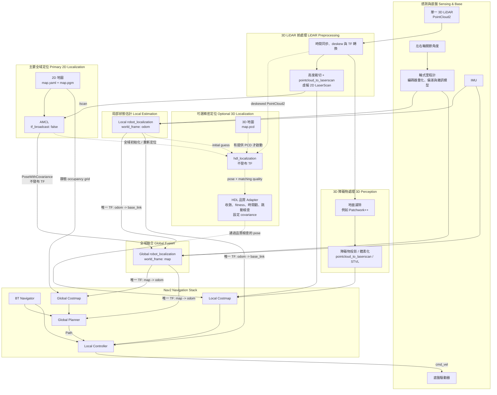

# 2D / 3D 定位與導航架構

AMCL 是主要全域定位來源；當啟動時有提供與 PGM 同座標系的 PCD，
才額外啟動 `hdl_localization`。AMCL 與 HDL 都不發布 TF，而是將位姿交給
Global EKF 融合，確保 `map -> odom` 只有一個發布者。

## TF 發布權責

| TF | 唯一發布者 |
|---|---|
| `map -> odom` | Global `robot_localization` |
| `odom -> base_link` | Local `robot_localization` |
| `base_link -> lidar`、`base_link -> imu` | `robot_state_publisher` 或 static TF |

AMCL 必須設定 `tf_broadcast: false`。`hdl_localization` 也必須關閉 TF
發布功能；實際參數名稱依採用的 ROS 2 port 而定。

## 運作模式

- **只有 PGM：**啟動 AMCL；Local EKF 與 Global EKF 各自使用輪式里程計和 IMU，
  Global EKF 再額外融合 AMCL 的全域位姿。
- **PGM + PCD：**AMCL 仍負責主要全域定位；HDL 通過品質 Adapter 後，提供額外的
  3D 精密修正。
- **HDL 品質不佳：**Adapter 停止發布或提高 covariance，Global EKF 自然退回以
  AMCL 為主要全域定位來源。
- **地面車限制：**導航主要使用 `x/y/yaw`；`roll/pitch` 以 IMU 為主，`z` 應固定
  或嚴格限制，避免平坦環境中的 3D 配準漂移。

PGM 應由同一份 PCD 投影產生，並保留一致的 `map` 原點、方向與尺度，否則 AMCL
與 HDL 的位姿不能直接融合。產生 PGM 與即時虛擬 LaserScan 時，也應使用一致的
高度裁切範圍，確保 AMCL 看到的牆面與 2D 地圖相符。

Local EKF 與 Global EKF 可訂閱相同的輪式里程計和 IMU 原始資料，但 Global EKF
不應直接融合 Local EKF 的完整 pose 輸出。這可避免 Global EKF 為了轉換
`odom` frame 的 pose 而依賴自己發布的 `map -> odom`，形成 TF 循環。
