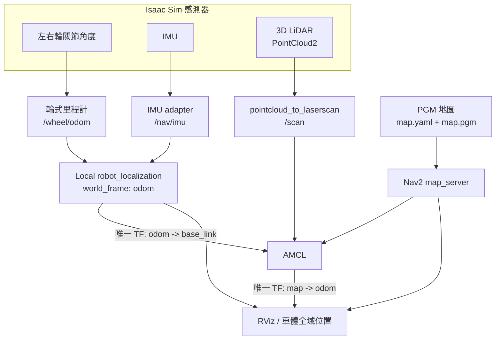
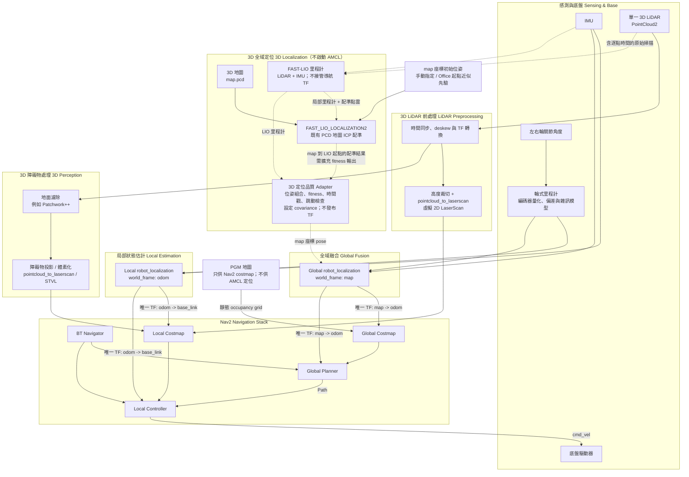

# 2D 定位現況與 3D 定位目標架構

目前 `run_nav.sh` 僅實作 2D 定位：輪式里程計與 IMU 進 Local EKF，
由 Local EKF 發布 `odom -> base_link`；3D LiDAR 投影成 `/scan` 供 AMCL，
由 AMCL **獨自**發布 `map -> odom`。沒有啟動 Global EKF 或 3D 定位。
停車時 AMCL 若沒有新位姿，`map -> odom` 會保持不變，避免 Global EKF
在缺少全域校正時繼續預測出不合理的位移。

未來若提供與 PGM 同座標系的 PCD，規劃切換到以下目標架構：
停用 AMCL（PGM 只供 Nav2 costmap 使用），將
[FAST_LIO_LOCALIZATION2](https://github.com/Smart-Wheelchair-RRC/FAST_LIO_LOCALIZATION2)
的 PCD 配準結果轉為品質閘控後的全域 pose，結合輪式里程計與 IMU，
由全域融合節點獨自發布 `map -> odom`。**兩種模式不能同時發布這條 TF。**
獨立的 3D 定位模式已由 `isaac_localization_3d` 套件及 `./run_3d_localization.sh`
提供，可在 RViz 的 Office PGM 地圖上觀察 PCD 配準位置。此模式的
`map -> camera_init -> body -> base_link` TF 只在配準被接受後發布
`map -> camera_init`，**不與**現行 2D 導航同時啟動；它不代表以下
PGM + PCD 導航全域融合已實作。操作方式見
[`ros2_ws/README.md`](../ros2_ws/README.md)。

## 只有 PGM：純 2D 定位（目前已實作）

以下是 `run_nav.sh` 的定位資料流；PGM 同時可供後續 Nav2 的
global costmap 使用。此模式不載入 PCD、不啟動 FAST_LIO_LOCALIZATION2
或 Global EKF。

```mermaid
flowchart TD
    subgraph Sensors ["Isaac Sim 感測器"]
        Joints["左右輪關節角度"]
        IMU["IMU"]
        Lidar["3D LiDAR<br/>PointCloud2"]
    end

    Joints --> WheelOdom["輪式里程計<br/>/wheel/odom"]
    IMU --> IMUAdapter["IMU adapter<br/>/nav/imu"]
    WheelOdom --> LocalEKF["Local robot_localization<br/>world_frame: odom"]
    IMUAdapter --> LocalEKF
    LocalEKF -->|"唯一 TF: odom -> base_link"| AMCL["AMCL"]

    Lidar --> Scan["pointcloud_to_laserscan<br/>/scan"]
    Scan --> AMCL
    PGM["PGM 地圖<br/>map.yaml + map.pgm"] --> MapServer["Nav2 map_server"]
    MapServer --> AMCL
    AMCL -->|"唯一 TF: map -> odom"| RViz["RViz / 車體全域位置"]
    LocalEKF --> RViz
    MapServer --> RViz
```

## 規劃中的 PGM + PCD 模式（尚未實作）

```mermaid
flowchart TD
    %% -------------------- 感測與底盤 --------------------
    subgraph Sensing ["感測與底盤 Sensing & Base"]
        WheelJoints["左右輪關節角度"]
        WheelOdom["輪式里程計<br/>編碼器量化、偏差與雜訊模型"]
        IMU["IMU"]
        Lidar3D["單一 3D LiDAR<br/>PointCloud2"]
        Chassis["底盤驅動器"]
    end

    %% -------------------- 點雲前處理 --------------------
    subgraph LidarPreprocessing ["3D LiDAR 前處理 LiDAR Preprocessing"]
        Deskew["時間同步、deskew 與 TF 轉換"]
        ScanProjection["高度裁切 + pointcloud_to_laserscan<br/>虛擬 2D LaserScan"]
    end

    %% -------------------- 局部狀態估計 --------------------
    subgraph LocalEstimation ["局部狀態估計 Local Estimation"]
        LocalEKF["Local robot_localization<br/>world_frame: odom"]
    end

    %% -------------------- 3D 全域定位 --------------------
    subgraph Localization3D ["3D 全域定位 3D Localization（不啟動 AMCL）"]
        PCD["3D 地圖<br/>map.pcd"]
        FastLIO["FAST-LIO 里程計<br/>LiDAR + IMU；不接管導航 TF"]
        FastLIOLocalization["FAST_LIO_LOCALIZATION2<br/>既有 PCD 地圖 ICP 配準"]
        FastLIOAdapter["3D 定位品質 Adapter<br/>位姿組合、fitness、時間戳、跳動檢查<br/>設定 covariance；不發布 TF"]
    end

    %% -------------------- 2D 導航地圖 --------------------
    PGM["PGM 地圖<br/>只供 Nav2 costmap；不供 AMCL 定位"]

    %% -------------------- 全域融合 --------------------
    subgraph GlobalFusion ["全域融合 Global Fusion"]
        GlobalEKF["Global robot_localization<br/>world_frame: map"]
    end

    %% -------------------- 3D 障礙物處理 --------------------
    subgraph Perception3D ["3D 障礙物處理 3D Perception"]
        GroundFilter["地面濾除<br/>例如 Patchwork++"]
        ObstacleProjection["障礙物投影 / 體素化<br/>pointcloud_to_laserscan / STVL"]
    end

    %% -------------------- Nav2 --------------------
    subgraph Nav2Stack ["Nav2 Navigation Stack"]
        BTNav["BT Navigator"]
        GlobalCostmap["Global Costmap"]
        LocalCostmap["Local Costmap"]
        GlobalPlanner["Global Planner"]
        LocalController["Local Controller"]
    end

    %% 輪式里程計與局部 EKF
    WheelJoints --> WheelOdom
    WheelOdom --> LocalEKF
    IMU --> LocalEKF
    WheelOdom --> GlobalEKF
    IMU --> GlobalEKF
    LocalEKF -->|"唯一 TF: odom -> base_link"| LocalCostmap
    LocalEKF -->|"唯一 TF: odom -> base_link"| LocalController

    %% PCD 配準提供唯一的全域定位觀測
    PCD --> FastLIOLocalization
    Lidar3D --> Deskew
    Lidar3D -.->|"含逐點時間的原始掃描"| FastLIO
    IMU -.-> FastLIO
    FastLIO -.->|"局部里程計 + 配準點雲"| FastLIOLocalization
    InitialPose["map 座標初始位姿<br/>手動指定 / Office 起點近似先驗"] --> FastLIOLocalization
    FastLIOLocalization -.->|"map 到 LIO 起點的配準結果<br/>需擴充 fitness 輸出"| FastLIOAdapter
    FastLIO -.->|"LIO 里程計"| FastLIOAdapter
    FastLIOAdapter -.->|"map 座標 pose"| GlobalEKF

    %% Global EKF 是 map -> odom 的唯一發布者
    GlobalEKF -->|"唯一 TF: map -> odom"| GlobalCostmap
    GlobalEKF -->|"唯一 TF: map -> odom"| GlobalPlanner

    %% Nav2 地圖與即時障礙物
    PGM -->|"靜態 occupancy grid"| GlobalCostmap
    Deskew --> ScanProjection
    ScanProjection --> LocalCostmap
    Deskew --> GroundFilter
    GroundFilter --> ObstacleProjection
    ObstacleProjection --> LocalCostmap

    %% Nav2 資料流
    BTNav --> GlobalPlanner
    BTNav --> LocalController
    GlobalCostmap --> GlobalPlanner
    GlobalPlanner -->|"Path"| LocalController
    LocalCostmap --> LocalController
    LocalController -->|"cmd_vel"| Chassis
```

## TF 發布權責

| TF | 唯一發布者 |
|---|---|
| `map -> odom` | 目前只有 PGM：AMCL；規劃中提供 PCD：Global `robot_localization`（不啟動 AMCL） |
| `odom -> base_link` | Local `robot_localization` |
| `base_link -> lidar`、`base_link -> imu` | `robot_state_publisher` 或 static TF |

目前 `run_nav.sh` 的 AMCL 使用 `tf_broadcast: true`。規劃中的 PCD
導航模式不啟動 AMCL，由 Global EKF 接管 `map -> odom`。
`FAST_LIO_LOCALIZATION2` 原版
`transform_fusion.py` 會發布 `map -> camera_init` TF，不能不修改就與目前
`odom -> base_link` 的導航 TF 鏈並用；規劃模式不啟動原版 TF 發布路徑，
由 Adapter 組合 `/map_to_odom` 配準結果與 `/Odometry` LIO 里程計，
轉成 `map` 座標的 `base_link` pose，僅交給 Global EKF 發布 `map -> odom`。
原版 fitness 只供內部閾值判斷和日誌使用，須另外提供品質資訊供 Adapter 閘控。
這個整合尚未實作或驗證。

## 運作模式

- **只有 PGM（目前已實作）：**Local EKF 融合輪式里程計和 IMU；AMCL
  使用 `/scan` 和 PGM 定位，直接發布 `map -> odom`。
- **提供 PCD（尚未實作導航整合）：**不啟動 AMCL；PGM 只供 Nav2
  costmap 使用。FAST_LIO_LOCALIZATION2 以 LiDAR–IMU 里程計和 PCD
  配準提供經品質 Adapter 檢查的 3D 全域位姿；輪速與 IMU 供局部／全域
  EKF 預測，由唯一的全域融合節點發布 `map -> odom`。
- **3D 配準品質不佳：**不能在沒有全域觀測時無限依賴輪速／IMU 預測；
  需偵測修正逾時、限制漂移並停止或降級導航，停車時的 Global EKF
  漂移仍須先查明；不會自動退回 AMCL。
- **地面車限制：**導航主要使用 `x/y/yaw`；`roll/pitch` 以 IMU 為主，`z` 應固定
  或嚴格限制，避免平坦環境中的 3D 配準漂移。

PGM 應由同一份 PCD 投影產生，並保留一致的 `map` 原點、方向與尺度，
否則 3D 定位的車體位姿與 Nav2 的 2D costmap 無法正確對齊。
即時虛擬 LaserScan 的高度裁切範圍也應與 PGM 地圖的障礙物相符。

Local EKF 與 Global EKF 可訂閱相同的輪式里程計和 IMU 原始資料，但 Global EKF
不應直接融合 Local EKF 的完整 pose 輸出。這可避免 Global EKF 為了轉換
`odom` frame 的 pose 而依賴自己發布的 `map -> odom`，形成 TF 循環。
FAST-LIO 的局部里程計只供該 3D 定位分支使用，不再當成另一筆獨立的
Global EKF 里程計輸入。
