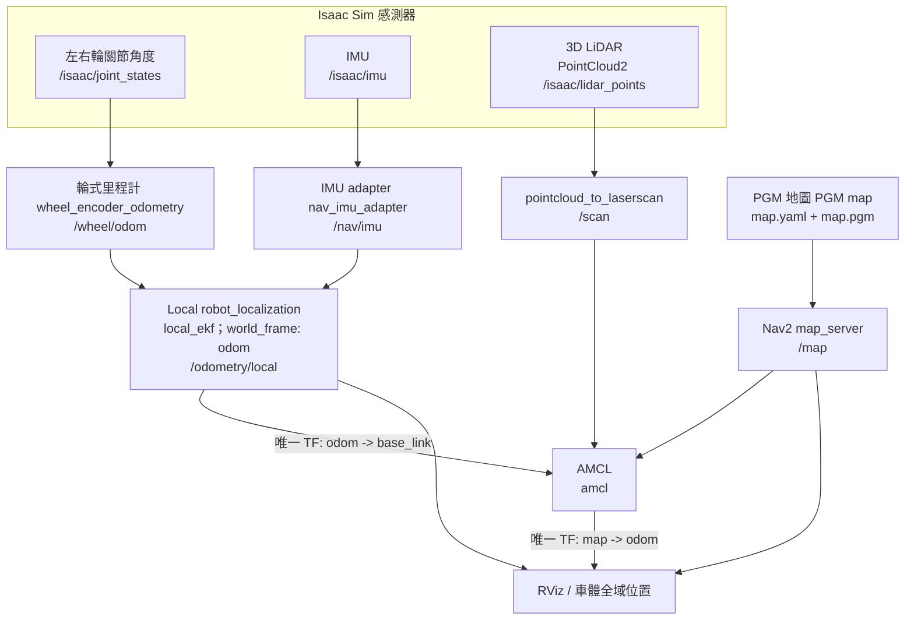
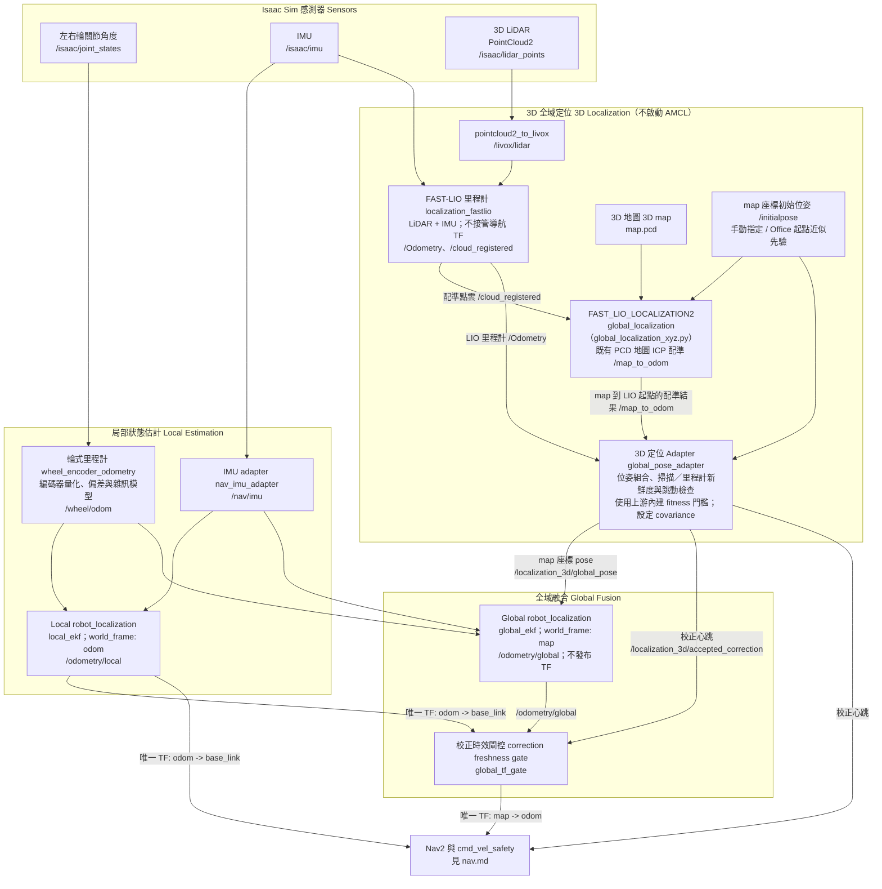

# 2D 與 3D 定位及導航架構

`scripts/run_nav.sh --mode 2d` 使用 2D 定位：輪式里程計與 IMU 進 Local EKF，由 Local EKF 發布 `odom -> base_link`；3D LiDAR 投影成 `/scan` 供 AMCL，由 AMCL **獨自**發布 `map -> odom`。沒有啟動 Global EKF 或 3D 定位。

停車時 AMCL 若沒有新位姿，`map -> odom` 會保持不變，避免 Global EKF 在缺少全域校正時繼續預測出不合理的位移。此入口將 2D 啟動交給可單獨執行的 `scripts/run_2d_localization.sh`。

3D 融合導航需使用與 PGM 同座標系的 PCD：停用 AMCL（PGM 只供 Nav2 costmap 使用），將 [FAST_LIO_LOCALIZATION2](https://github.com/Smart-Wheelchair-RRC/FAST_LIO_LOCALIZATION2) 的 PCD 配準結果轉為品質閘控後的全域 pose，結合輪式里程計與 IMU，由校正時效閘控節點（correction freshness gate，`global_tf_gate`）獨自發布 `map -> odom`。**2D AMCL 與 3D 融合模式不能同時發布這條 TF。**

獨立的 3D 定位模式已由 `slam_localization_3d` 套件及 `./scripts/run_3d_localization.sh` 提供，可在 RViz 的 Office PGM 地圖上觀察 PCD 配準位置。此模式的 `map -> camera_init -> body -> base_link` TF 只在配準被接受後發布 `map -> camera_init`，不與 2D 或 3D 融合導航同時啟動。操作方式見 [`ros2_ws/README.md`](../ros2_ws/README.md)。

## 只有 PGM：純 2D 定位（目前已實作）

以下是 `scripts/run_nav.sh --mode 2d` 的定位資料流；PGM 同時可供後續 Nav2 的 global costmap 使用。此模式不載入 PCD、不啟動 FAST_LIO_LOCALIZATION2 或 Global EKF。

```mermaid
flowchart TD
    subgraph Sensors ["Isaac Sim 感測器"]
        Joints["左右輪關節角度<br/>/isaac/joint_states"]
        IMU["IMU<br/>/isaac/imu"]
        Lidar["3D LiDAR<br/>PointCloud2 /isaac/lidar_points"]
    end

    Joints --> WheelOdom["輪式里程計 wheel_encoder_odometry<br/>/wheel/odom"]
    IMU --> IMUAdapter["IMU adapter nav_imu_adapter<br/>/nav/imu"]
    WheelOdom --> LocalEKF["Local robot_localization<br/>local_ekf；world_frame: odom<br/>/odometry/local"]
    IMUAdapter --> LocalEKF
    LocalEKF -->|"唯一 TF: odom -> base_link"| AMCL["AMCL<br/>amcl"]

    Lidar --> Scan["pointcloud_to_laserscan<br/>/scan"]
    Scan --> AMCL
    PGM["PGM 地圖 PGM map<br/>map.yaml + map.pgm"] --> MapServer["Nav2 map_server<br/>/map"]
    MapServer --> AMCL
    AMCL -->|"唯一 TF: map -> odom"| RViz["RViz / 車體全域位置"]
    LocalEKF --> RViz
    MapServer --> RViz
```

## PGM + PCD 模式：3D 定位與全域融合

下圖只畫 `scripts/run_nav.sh --mode 3d` 的定位資料流，終點是兩條 TF。之後 costmap、planner、controller 與 recovery 的導航流程見 [`nav.md`](nav.md)。

```mermaid
flowchart TD
    subgraph Sensors ["Isaac Sim 感測器 Sensors"]
        Joints["左右輪關節角度<br/>/isaac/joint_states"]
        IMU["IMU<br/>/isaac/imu"]
        Lidar["3D LiDAR<br/>PointCloud2 /isaac/lidar_points"]
    end

    subgraph LocalEstimation ["局部狀態估計 Local Estimation"]
        WheelOdom["輪式里程計 wheel_encoder_odometry<br/>編碼器量化、偏差與雜訊模型<br/>/wheel/odom"]
        IMUAdapter["IMU adapter nav_imu_adapter<br/>/nav/imu"]
        LocalEKF["Local robot_localization<br/>local_ekf；world_frame: odom<br/>/odometry/local"]
    end

    subgraph Localization3D ["3D 全域定位 3D Localization（不啟動 AMCL）"]
        Livox["pointcloud2_to_livox<br/>/livox/lidar"]
        FastLIO["FAST-LIO 里程計 localization_fastlio<br/>LiDAR + IMU；不接管導航 TF<br/>/Odometry、/cloud_registered"]
        PCD["3D 地圖 3D map<br/>map.pcd"]
        InitialPose["map 座標初始位姿 /initialpose<br/>手動指定 / Office 起點近似先驗"]
        ICP["FAST_LIO_LOCALIZATION2<br/>global_localization（global_localization_xyz.py）<br/>既有 PCD 地圖 ICP 配準 /map_to_odom"]
        Adapter["3D 定位 Adapter global_pose_adapter<br/>位姿組合、掃描／里程計新鮮度與跳動檢查<br/>使用上游內建 fitness 門檻；設定 covariance"]
    end

    subgraph GlobalFusion ["全域融合 Global Fusion"]
        GlobalEKF["Global robot_localization<br/>global_ekf；world_frame: map<br/>/odometry/global；不發布 TF"]
        TFGate["校正時效閘控 correction freshness gate<br/>global_tf_gate"]
    end

    Nav["Nav2 與 cmd_vel_safety<br/>見 nav.md"]

    Joints --> WheelOdom
    IMU --> IMUAdapter
    WheelOdom --> LocalEKF
    IMUAdapter --> LocalEKF
    WheelOdom --> GlobalEKF
    IMUAdapter --> GlobalEKF

    Lidar --> Livox --> FastLIO
    IMU --> FastLIO
    PCD --> ICP
    InitialPose --> ICP
    InitialPose --> Adapter
    FastLIO -->|"配準點雲 /cloud_registered"| ICP
    ICP -->|"map 到 LIO 起點的配準結果 /map_to_odom"| Adapter
    FastLIO -->|"LIO 里程計 /Odometry"| Adapter
    Adapter -->|"map 座標 pose<br/>/localization_3d/global_pose"| GlobalEKF
    Adapter -->|"校正心跳<br/>/localization_3d/accepted_correction"| TFGate
    GlobalEKF -->|"/odometry/global"| TFGate
    LocalEKF -->|"唯一 TF: odom -> base_link"| TFGate

    TFGate -->|"唯一 TF: map -> odom"| Nav
    LocalEKF -->|"唯一 TF: odom -> base_link"| Nav
    Adapter -->|"校正心跳"| Nav
```

`global_tf_gate` 以 `/odometry/global` 和同時間的 `odom -> base_link` 算出 `map -> odom`；校正心跳同時供 `cmd_vel_safety` 判斷校正是否過期。

3D 定位與導航感知使用同一份 `/isaac/lidar_points`，但分開處理；導航用的 `/perception/obstacles` 與 `/scan` 如何產生，見 [`nav.md` 的「感測 → costmap」](nav.md#感測--costmap)。

## TF 發布權責

| 模式                   | `map -> odom` 唯一發布者     | `odom -> base_link` |
| :--------------------- | :--------------------------- | :------------------ |
| `scripts/run_nav.sh --mode 2d` | AMCL（`amcl`，`tf_broadcast: true`） | Local EKF（`local_ekf`） |
| `scripts/run_nav.sh --mode 3d` | 校正時效閘控節點（`global_tf_gate`） | Local EKF（`local_ekf`） |

LiDAR 與 IMU 的固定座標轉換由 `robot_state_publisher` 或 static TF 提供。

3D 融合模式不啟動 AMCL。`FAST_LIO_LOCALIZATION2` 原版 `transform_fusion.py` 發布的是另一條 `map -> camera_init` TF，不接入上述導航 TF 鏈；原版獨立 3D 展示模式也不能與融合導航同時啟動。

LiDAR／IMU 經 FAST-LIO 與 PCD 配準，上游先依 ICP fitness 門檻篩選校正。Adapter（`global_pose_adapter`）再結合 `/map_to_odom` 和 `/Odometry`，檢查掃描與里程計的新鮮度及位姿跳動，產生 `map` 座標的 `base_link` 位姿供 Global EKF 融合。輪速與 IMU 同時供 Local／Global EKF 預測。

Global EKF（`global_ekf`）設為 `publish_tf: false`；閘控節點 `global_tf_gate` 只在近期有有效 PCD 校正時，
依 `/odometry/global` 和同時間的局部 TF 發布 `map -> odom`。
若局部 TF 晚到，最多等待 0.1 秒；仍無 TF 則不發布該筆轉換。
合成位姿仍使用里程計原時間戳；發布時將 `map -> odom` TF 前推
`tf_future_tolerance`（預設 0.1 秒，最多 0.5 秒），讓 Nav2 在下一筆局部
TF 先到時仍可查詢轉換。前推只涵蓋短暫時序差，不延長 PCD 校正時效；
校正過期或局部 TF 缺失仍停止發布，命令安全節點也不放寬校正時效。
Nav2 controller 的路徑控制遇到短暫 TF／控制失敗時會發布零速並重試，
最多容忍 1 秒；持續失敗則中止目標。
不要同時啟動 2D AMCL、3D 融合或獨立 3D 展示模式。

## 選擇啟動方式

| 入口                                | 功能                                                                             |
| :---------------------------------- | :------------------------------------------------------------------------------- |
| `./scripts/run_3d_localization.sh`          | 獨立 3D 配準展示，不啟動融合導航                                                 |
| `./scripts/run_nav.sh --mode 2d`            | PGM + AMCL 定位                                                                  |
| `./scripts/run_nav.sh --mode 3d`            | PCD 融合與 costmap 觀察，不啟動自動導航                                          |
| `./scripts/run_nav.sh --mode 3d --navigate` | 再啟動 Nav2 planner、controller 與導航，從 RViz「2D Goal Pose」發送 `/goal_pose` |

`scripts/run_nav.sh --mode 3d` 會以 `--global-fusion --costmaps` 呼叫 `scripts/run_3d_localization.sh`；若只想觀察 3D 融合而不啟動 costmap，可直接使用 `./scripts/run_3d_localization.sh --global-fusion`。`--costmaps` 會開啟 `--obstacle-cloud`，將地面濾除後的 LiDAR 點雲發布為 `/perception/obstacles`；只有 `--obstacle-cloud` 不會啟動 costmap。

加上 `--navigate` 後的 costmap、路徑規劃、控制、recovery 與 `cmd_vel` 安全鏈見 [`nav.md`](nav.md)。導航時不能同時使用鍵盤或 auto-jog。

## 參數與限制

- **控制**：手動 W/S 與導航線速度上限為 0.75 m/s；Nav2 目標速度 0.5 m/s，固定前視距離 0.8 m，必要時依曲率、接近目標及碰撞預測降速。命令中斷 0.5 秒或 PCD 校正逾時 4 秒時停車。
- **輪速**：Nova Carter 驅動輪接地碰撞體半徑 0.14 m、輪距 0.4132 m；控制器與輪速里程計須使用一致幾何，否則定位校正會持續補償里程誤差。
- **航向**：2D／3D 共用的 `slam_nav/config/local_odometry.yaml` 讓 Local EKF 融合輪速 yaw 位姿與 IMU 角速度；2D 專用的 AMCL、地圖伺服器及 RViz 啟動設定在 `slam_localization_2d`。輪速航向約束停車時的陀螺儀偏差累積，但打滑時輪速仍可能漂移，真車須重新定標輪速不確定度。局部 costmap 刻意使用 `odom`，在 RViz 的 `map` 座標下會隨 `map -> odom` 校正呈現旋轉，不應僅為了讓畫面平行而改成 `map`。
- **障礙物**：低於 `/scan` 裁切高度的障礙物可能被濾掉。`--obstacle-cloud` 以 RANSAC 分割近水平地面並以 8 cm 體素降採樣；地面無效時停止發布障礙點雲，但 self-filtered 分支仍可產生 `/scan`，TF 無效時兩個分支都受影響。感知資料流與限制見 [`nav.md`](nav.md)。斜坡、動態障礙物清除與狹窄路線的碰撞安全仍未驗證。
- **定位品質**：PCD 定位輸出 ICP covariance 加上 `min_covariance_xy/yaw` 下限，並以 FAST-LIO 位姿的時間戳送入 Global EKF（`smooth_lagged_data` 會回溯修正延遲的量測）。輪速 covariance 依實際移動距離與轉角動態累積。各項數值由 `covariance_calibration.py` 定標，換車流程見 [covariance_calibration.md](covariance_calibration.md)。PCD 校正失效時不會自動切換 AMCL。車體定位以 `x/y/yaw` 為主，尚未完成真值精度及真實車輛安全驗證。

## 地圖與融合設定原則

PGM 應由同一份 PCD 投影產生，並保留一致的 `map` 原點、方向與尺度，否則 3D 定位的車體位姿與 Nav2 的 2D costmap 無法正確對齊。

即時虛擬 LaserScan 的高度裁切範圍也應與 PGM 地圖的障礙物相符。

Local EKF 與 Global EKF 可訂閱相同的輪式里程計和 IMU 原始資料，但 Global EKF 不應直接融合 Local EKF 的完整 pose 輸出。這可避免 Global EKF 為了轉換 `odom` frame 的 pose 而依賴自己發布的 `map -> odom`，形成 TF 循環。

FAST-LIO 的局部里程計只供該 3D 定位分支使用，不再當成另一筆獨立的 Global EKF 里程計輸入。
