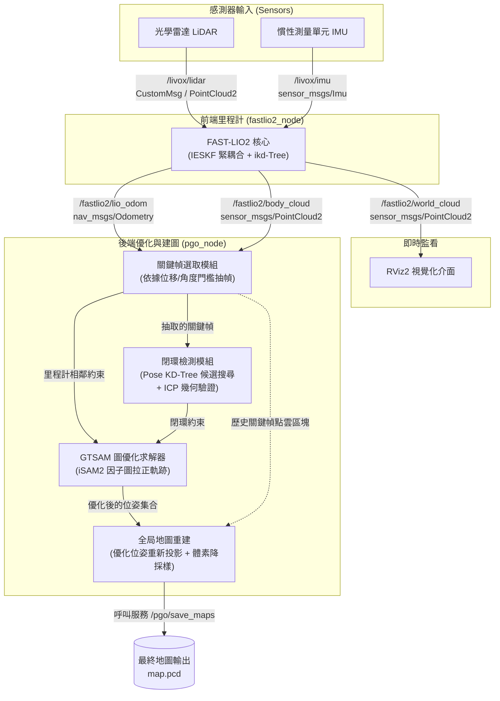

```mermaid
flowchart TD
    subgraph Sensors ["感測器輸入 (Sensors)"]
        LiDAR["光學雷達 LiDAR"]
        IMU["慣性測量單元 IMU"]
    end

    subgraph FrontEnd ["前端里程計 (fastlio2_node)"]
        LIO["FAST-LIO2 核心<br>(IESKF 緊耦合 + ikd-Tree)"]
    end

    subgraph Visual ["即時監看"]
        RViz["RViz2 視覺化介面"]
    end

    subgraph BackEnd ["後端優化與建圖 (pgo_node)"]
        Keyframe["關鍵幀選取模組<br>(依據位移/角度門檻抽幀)"]
        LoopDetect["閉環檢測模組<br>(Pose KD-Tree 候選搜尋<br>+ ICP 幾何驗證)"]
        GTSAM["GTSAM 圖優化求解器<br>(iSAM2 因子圖拉正軌跡)"]
        Reconstruct["全局地圖重建<br>(優化位姿重新投影 + 體素降採樣)"]
    end

    PCD[("最終地圖輸出<br>map.pcd")]

    %% 數據流連接
    LiDAR -->|/livox/lidar<br>CustomMsg / PointCloud2| LIO
    IMU -->|/livox/imu<br>sensor_msgs/Imu| LIO

    LIO -->|/fastlio2/world_cloud<br>sensor_msgs/PointCloud2| RViz
    LIO -->|/fastlio2/lio_odom<br>nav_msgs/Odometry| Keyframe
    LIO -->|/fastlio2/body_cloud<br>sensor_msgs/PointCloud2| Keyframe

    Keyframe -->|抽取的關鍵幀| LoopDetect
    Keyframe -->|里程計相鄰約束| GTSAM
    LoopDetect -->|閉環約束| GTSAM
    GTSAM -->|優化後的位姿集合| Reconstruct
    Keyframe -.->|歷史關鍵幀點雲區塊| Reconstruct

    Reconstruct -->|呼叫服務 /pgo/save_maps| PCD
```