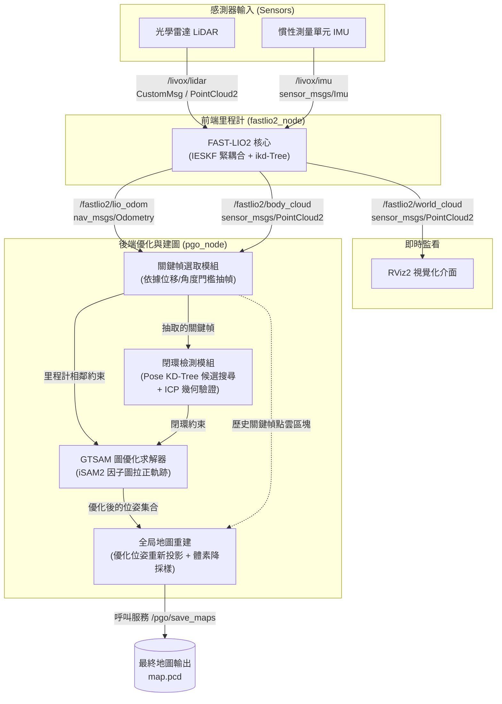

## PGO 與存圖細節

- PGO 從 `/fastlio2/body_cloud` 與 `/fastlio2/lio_odom` 選關鍵幀，以 KD-tree 搜尋先前位姿，用 ICP 對局部子圖驗證候選，再以 GTSAM iSAM2 優化位姿圖。閉環以位姿鄰近為候選，所以目前軌跡必須回到先前位置的搜尋半徑內才可能驗證成功。
- PGO 仍發布 `map` 到 `lidar` 的校正 TF，但 RViz 的 fixed frame 固定為 `lidar`，避免 PGO 的 TF 延遲擋住即時點雲。
- `docker/build_workspace.sh` 建置上游 PGO 時會套用 `patches/fastlio2-pgo-sync.patch`：精確比對點雲與里程計時間戳、模擬時鐘重置時恢復、原子取用最新佇列量測，並記錄接受的關鍵幀與閉環；建置後 submodule 會還原，維持乾淨。
- `save_map.sh` 寫入 `map.pcd`、`poses.txt` 與（選用）`patches/`。寫入 `map.pcd` 前套用 `src/FASTLIO2_ROS2/pgo/config/pgo.yaml` 的 `save_map_resolution`（預設 0.1 m）；`--voxel-size` 只覆寫該次執行，設為 `0` 則不降採樣。`patches/` 內的檔案維持關鍵幀原解析度。`--save-patches` 預設為 `true`，`--output-dir` 預設 `maps/office`。

## PCD 轉 2D 地圖

`./scripts/pcd2pgm.py` 預設讀 `maps/office/map.pcd`，輸出 `maps/office/map_2d.pgm` 與 `map_2d.yaml`，投影 0.1–2.0 m 的點，解析度 0.05 m：

```bash
./scripts/pcd2pgm.py maps/office/map.pcd maps/office/map_2d \
  --z-min 0.1 --z-max 2.0 --resolution 0.05
```

`--min-points` 可剔除點數稀疏的格子，`--inflation` 擴大障礙物（通常交給 Nav2 costmap 處理較好），`--background unknown` 讓未占用格子保持未知。合併後的 PCD 只有障礙物回波、沒有原始光線，無法精確還原已觀測的空地與未知區，預設以空地為背景，與常見的 PCD 轉 PGM 工具一致。
