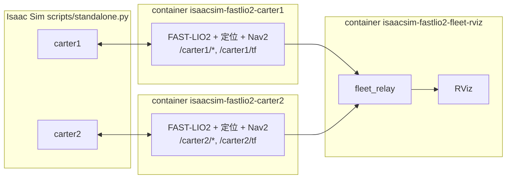

# 多車導航

一個腳本啟動 Isaac Sim、依參數生成 N 台車，每台車一個獨立的導航 container（與真車一車一台電腦相同），再加上一個顯示全部車輛的 RViz。

```bash
./scripts/run_multi_nav.sh                                   # Nova Carter + Carter v1
./scripts/run_multi_nav.sh --robot carter1@0,0 --robot carter2:carter_v1@3.5,0
./scripts/run_multi_nav.sh --headless --no-rviz              # 無 GUI
./scripts/run_multi_nav.sh --help
```

相機串流與 MQTT 等對外連線見[對外連線文件](online.md)（`run_multi_nav_online.sh`）。

車輛規格：`NAME[:TYPE]@X,Y[,YAW]`

- `NAME`：namespace，英數字與底線，不分大小寫不可重複（同時作為 Compose project 名稱）。
- `TYPE`：車種，對應 `config/robots/TYPE.yaml`，預設 `nova_carter`。
- `X,Y,YAW`：Isaac world 位置（m）與 robot prim 航向（rad）；Office 地圖與 Isaac world 對齊，所以也是地圖座標。

不指定 `--robot` 時，預設為 `carter1:nova_carter@0,0,0` 與 `carter2:carter_v1@3.5,0,0`。按 Ctrl+C 會停止 Isaac 並移除所有 container。

兩種車都以差速驅動輪那端為車頭，正 `linear.x` 朝 USD +x 行駛。多於一台車時，Isaac viewport 固定在生成點中心上方俯視（右方 +X、上方 +Y，與 RViz 一致）；單車時維持跟車視角。

## 架構



- **一車一 container**：`robot.launch.py robot:=NAME[:TYPE]@X,Y,YAW` 啟動單車完整堆疊，所有 topic、action、service 都在 `/NAME` 下。
- **每車獨立 TF 樹**：TF 重映射到 `/NAME/tf`、`/NAME/tf_static`，frame 名稱不變（`map`、`odom`、`base_link`…），各車設定檔與單車版本相同。
- **Fleet RViz**：`fleet_rviz.launch.py robots:="carter1;carter2"` 執行 `fleet_relay.py`，把各車 TF 與機體座標系 topic 轉發到 `/fleet/...` 並加上 `NAME/` 前綴；`map` 座標系的 topic（路徑、costmap、`odometry/global` 等）由 RViz 直接訂閱 `/NAME/...`。
- **Isaac 端**：`scripts/standalone.py --robot ...` 為每台車建立 `/NAME/...` 的 LiDAR、IMU、`cmd_vel`、輪速與 ground truth topic；`/clock` 只由第一台車發佈。

## 送導航目標

在 RViz 的 **Fleet Control** 面板選擇車輛，按 **Set navigation goal**，在地圖上按住左鍵拖曳設定目標與航向。**Set initial pose** 用來重設選中車輛的定位。工具列的 **2D Goal Pose／2D Pose Estimate** 也會使用目前選中的車輛。

或直接指定車輛的 action：

```bash
ros2 action send_goal /carter2/navigate_to_pose nav2_msgs/action/NavigateToPose \
  "{pose: {header: {frame_id: map}, pose: {position: {x: 3.5, y: -2.5}, orientation: {w: 1.0}}}}"
```

## 初始位姿

預設以生成位姿自動設定初始位姿（`--manual-initial-pose` 改由 RViz 設定）。`robot_fleet.initial_pose()` 把每台車的 body 位姿換算到錄製地圖的參考車 body frame，作為 `map → camera_init` 的猜測值，再由 ICP 修正。`global_localization_xyz.py` 覆寫上游的初始化函式，讓 ICP 失敗後的重試仍從該猜測值開始。

## 部署到真車

每台車的電腦執行與模擬相同的 launch，只換 namespace、車種與初始位姿：

```bash
ros2 launch slam_localization_3d global_fusion.launch.py \
  namespace:=carter1 robot_type:=nova_carter \
  initial_x:=0.0 initial_y:=0.0 initial_z:=0.0 initial_yaw:=0.0 \
  map_pcd:=... map_pgm:=...
```

監控端執行 `fleet_rviz.launch.py robots:="carter1;carter2"`。各車需使用相同的 `ROS_DOMAIN_ID`，且感測驅動需發佈到 `/NAME/...` 下對應的 topic。

## 新增車種

複製 `ros2_ws/src/slam_localization_3d/config/robots/nova_carter.yaml` 成 `<type>.yaml` 並修改：

| 鍵 | 用途 |
| :-- | :-- |
| `simulation.*` | Isaac 資產、articulation／LiDAR／IMU prim、輪子關節、輪徑、輪距、前進方向、生成高度 |
| `simulation.lidar_translation`（選用） | 覆寫 LiDAR prim 相對 parent 的位置（m） |
| `local_odometry.inputs` | `local_ekf` 融合的來源（`wheel`、`imu`、`lio`），見 [`3d_localization.md`](3d_localization.md#local-ekf-輸入選擇)；非輪式機器人用 `[lio, imu]` |
| `sensor_frames` | `base_link` 到 `lidar_link`、`imu_link` 的靜態 TF；`imu_link` 即 FAST-LIO body 的安裝位置 |
| `parameter_overrides` | 深度合併到各參數檔：輪速里程計與 covariance、IMU／PCD covariance、costmap footprint、self filter、collision monitor 與 adaptive surround 區域、速度與加速度上限 |
| `ground_obstacle_filter.ros__parameters.ground_z` | 地面相對 `base_link` 的高度（Nova Carter `0.0`、Carter v1 `-0.24` m），見 [nav.md](nav.md) |

接著以 `--robot NAME:<type>@X,Y` 使用。車種相關值只寫在 profile，缺少必要項目會在載入時報錯；footprint、安全區域與速度的共用預設為 Nova Carter 的值，其他車種需逐項替換並自行驗證。covariance 校正流程見 [covariance_calibration.md](covariance_calibration.md)。

2D 定位模式（`localization_2d.launch.py`）只支援 Nova Carter。

## 外部派車系統（如 Open-RMF）

本專案不含車輛間的路權與交通管理，這部分由外部派車系統負責；例如在外部執行 Open-RMF 並自行撰寫 fleet adapter，把這套環境當成多台自走車使用。可用的介面（`NAME` 為車輛 namespace）：

| 需求 | 介面 |
| :-- | :-- |
| 下達目標 | action `/NAME/navigate_to_pose`（`nav2_msgs/NavigateToPose`），`frame_id: map`；取消用 action cancel |
| 車輛位姿 | `/NAME/odometry/global`（`map` 座標），或 `/NAME/tf` 的 `map -> base_link`（TF 已重映射到 `/NAME/tf`） |
| 即時速度 | `/NAME/odometry/local` |
| 緊急停車 | `/NAME/navigation/emergency_stop`（`Bool`）；鎖定停車，需重啟才能恢復，不是一般暫停 |
| 時間 | `/clock`，只由第一台車發布；外部節點須使用模擬時間（`use_sim_time`） |

整合時須注意：

- **網路**：外部程式與本專案使用相同的 `ROS_DOMAIN_ID`、`ROS_LOCALHOST_ONLY` 與 RMW；container 為 host network，主機上的程式可直接看到 topic。ROS 版本須與 Humble 的介面相容。
- **座標**：`map` 與 Isaac world 對齊，nav graph 直接使用 Isaac 座標，不需換算。
- **逐段下單**：Nav2 只追蹤單一目標，不會執行外部系統的時間預約。要讓外部系統的協調生效，fleet adapter 須照計畫把路徑點逐段送給 Nav2，需要等待時不送下一段或取消目前目標，並持續回報位姿。兩點之間由 Nav2 自行規劃，路徑點要夠密才不會偏離計畫車道。
- **保護區比車體大**：collision monitor 的 Surround 是固定矩形（Nova Carter：x −1.35–0.80 m、y ±0.75 m；Carter v1：x −1.10–0.80 m、y ±0.81 m），遠大於車體寬度。外部系統的車輛 profile（vicinity）與車道間距須配合這個範圍，否則兩車在外部系統認為安全的間距下通過，仍會觸發對方的保護區而停車，與計畫不一致。
- **到位與失敗**：到位容差為位置 0.15 m、航向 0.25 rad，到位後鎖定。導航失敗時 recovery 約 30 秒後才中止目標（`ABORTED`），adapter 須設逾時並回報重新規劃。
- **電量**：沒有 `BatteryState`，需由 adapter 自行提供。
- 車輛須已完成定位並出現 `navigator active` 後才能下單；生成位置與車種由 `run_multi_nav.sh --robot ...` 決定。

## 目前限制

- 車輛之間沒有協調：彼此只當作 LiDAR 障礙物，沒有路權或交通管理，單獨使用時對向可能互相卡住；需由上述外部派車系統協調。
- 鍵盤操控已停用，多車使用 ROS `cmd_vel`。
- `filter_editor`（Keepout／Speed）與單車 validation 場景仍只支援單車。
- Fleet RViz 不顯示 local costmap。
- 兩台以上時模擬速度約為即時的 0.8 倍，更多車輛的效能未驗證。
