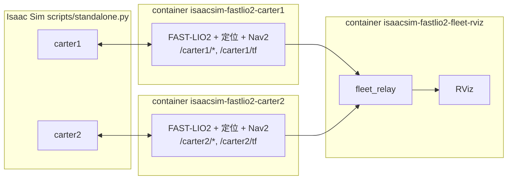

# 多車導航

一個腳本啟動 Isaac Sim、依參數生成 N 台車，每台車一個獨立的導航 container（與部署到真車時一車一台電腦相同），再加上一個顯示全部車輛的 RViz。

```bash
./scripts/run_multi_nav.sh                                   # Nova Carter + Carter v1
./scripts/run_multi_nav.sh --robot carter1@0,0 --robot carter2:carter_v1@3.5,0
./scripts/run_multi_nav.sh --robot a@0,0 --robot b@3.5,-2,1.57 --robot c@1,2
./scripts/run_multi_nav.sh --headless --no-rviz              # 無 GUI
./scripts/run_multi_nav.sh --help
```

車輛規格：`NAME[:TYPE]@X,Y[,YAW]`

- `NAME`：namespace，英數字與底線，不分大小寫不可重複（同時作為 Compose project 名稱）。
- `TYPE`：車種，對應 `config/robots/TYPE.yaml`，預設 `nova_carter`。
- `X,Y,YAW`：Isaac world 位置（m）與 robot prim 航向（rad）。Office 地圖與 Isaac world 對齊，所以也是地圖座標。

按 Ctrl+C 會停止 Isaac 並移除所有 container。

不指定任何 `--robot` 時，預設是 `carter1:nova_carter@0,0,0` 與 `carter2:carter_v1@3.5,0,0`。自行指定規格時省略 TYPE 仍為 Nova Carter；要恢復兩台 Nova Carter，可執行 `--robot carter1@0,0 --robot carter2@3.5,0`。

兩種車都以差速驅動輪那端為車頭，正 `linear.x` 朝 USD +x 行駛，萬向輪在後方。Nova Carter 的舊設定曾把車頭定義成 USD −x；修正後同步調整 encoder 左右輪／符號、sensor TF、footprint、自體濾除及保護區。既有 Office 地圖的 LiDAR／IMU body 原點與方向沒有改變，不需重建 PCD／PGM 地圖；舊的 base_link 初始航向、路線及校正紀錄則不能直接套用，需重新驗證。

多於一台車時，Isaac viewport 固定在所有生成點中心的正上方俯視（螢幕右方為 +X、上方為 +Y，與 RViz 一致），不跟隨任何車；高度依生成點範圍加 5 m 邊界自動計算，並裁切 2.6 m 以上的天花板。之後仍可用滑鼠自由移動視角（移動後會恢復預設裁切，拉近不會被裁掉）。單車時維持跟車視角。

## 架構



- **一車一 container**：`robot.launch.py robot:=NAME[:TYPE]@X,Y,YAW` 啟動單車完整堆疊（`global_fusion.launch.py`），所有 topic、action、service 都在 `/NAME` 下。
- **每車獨立 TF 樹**：TF 重映射到 `/NAME/tf`、`/NAME/tf_static`，frame 名稱不變（`map`、`odom`、`base_link`…）。因此各車設定檔、Nav2 參數與單車版本完全相同，真車部署時不需改 frame。
- **Fleet RViz**：`fleet_rviz.launch.py robots:="carter1;carter2"` 執行 `fleet_relay.py`：
  - `/NAME/tf(_static)` → `/fleet/tf(_static)`，frame 加上 `NAME/` 前綴（`map` 除外，所有車共用）。
  - 機體座標系的 topic（`scan`、`perception/obstacles`、collision monitor polygon）轉發到 `/fleet/NAME/...` 並改寫 `frame_id`。
  - 位於 `map` 座標系的 topic（路徑、global footprint、`odometry/global`、global costmap、地圖）RViz 直接訂閱 `/NAME/...`，不需轉發。
  - RViz 設定由 `robot_fleet.fleet_rviz()` 產生：每車一個顏色的 display group，加上 **Fleet Control** 選車面板及一組共用的「2D Pose Estimate／2D Goal Pose」工具。
  - 每車群組預設顯示粉紅色 **Collision surround stop zone**，透過 `/fleet/NAME/collision_monitor/polygon_surround` 顯示目前啟用的 Surround；方向切換完成後，形狀會跟著更新。Stop／Slow 停用時 RViz 可能保留最後一筆圖形，仍看得到不代表仍在生效。
- Isaac 端：`scripts/standalone.py --robot ...` 為每台車建立 `/NAME/...` 的 LiDAR、IMU、`cmd_vel`、輪速與 ground truth topic。`/clock` 只由第一台車發佈；`/diagnostics` 為全域共用。

## 送導航目標

在 RViz 的 **Fleet Control** 面板，用下拉選單選擇車輛，再按 **Set navigation goal**，於地圖上按住左鍵拖曳，設定目標位置與航向。面板會顯示實際目的 topic，例如 `/carter2/goal_pose`。

**Set initial pose** 用來重新設定選中車輛的定位，不是導航目標。工具列原有的 **2D Goal Pose／2D Pose Estimate** 也會同步使用目前選中的車輛，不必手動修改 topic。切車不會取消已送出的導航、不會隱藏其他車；若正在拖曳但尚未放開滑鼠，切車會中止這次未完成的操作，避免把目標送錯車。選車狀態可隨 RViz 設定保存。

或直接指定車輛的 action：

```bash
ros2 action send_goal /carter2/navigate_to_pose nav2_msgs/action/NavigateToPose \
  "{pose: {header: {frame_id: map}, pose: {position: {x: 3.5, y: -2.5}, orientation: {w: 1.0}}}}"
```

## 初始位姿

預設以生成位姿自動設定初始位姿（`--manual-initial-pose` 則改由 RViz 設定）。地圖是從參考車（`carter1` 在原點）的 body frame 錄製的，所以 `robot_fleet.initial_pose()` 將每台車的 body 位姿（robot prim 加上 profile 的 `sensor_frames`）轉換到參考車 body frame，作為 `map → camera_init` 的猜測值，再由 ICP 修正。

上游 FAST_LIO_LOCALIZATION 的 `cb_initialize_pose` 只用猜測值做一次 ICP；若失敗，之後的重試會從 identity 開始而永遠收斂不了（遠離原點的車容易發生）。`global_localization_xyz.py` 覆寫此函式，先把猜測值寫入 `T_map_to_odom`，讓重試都從猜測值開始。

## 部署到真車

每台車的電腦執行與模擬相同的 launch，只換 namespace、車種與初始位姿：

```bash
ros2 launch slam_localization_3d global_fusion.launch.py \
  namespace:=carter1 robot_type:=nova_carter \
  initial_x:=0.0 initial_y:=0.0 initial_z:=0.0 initial_yaw:=0.0 \
  map_pcd:=... map_pgm:=...
```

或使用 `robot.launch.py robot:=carter1@X,Y,YAW`（從 Isaac world 生成位姿換算初始位姿）。監控端執行 `fleet_rviz.launch.py robots:="carter1;carter2"`。各車需使用相同的 `ROS_DOMAIN_ID`，且感測驅動需發佈到 `/NAME/...` 下對應的 topic。

## 新增車種

複製 `ros2_ws/src/slam_localization_3d/config/robots/nova_carter.yaml` 成 `<type>.yaml` 並修改：

| 鍵 | 用途 |
| :-- | :-- |
| `simulation.*` | Isaac 資產、articulation／LiDAR／IMU prim、輪子關節、輪徑、輪距、前進方向、生成高度 |
| `simulation.lidar_translation`（選用） | 覆寫 LiDAR prim 相對 parent 的位置（m）；同步更新 `sensor_frames`，避免點雲與 ROS TF 的安裝位置不同 |
| `local_odometry.inputs` | `local_ekf` 融合的來源（`wheel`、`imu`、`lio`），見 [`3d_localization.md` 的「Local EKF 輸入選擇」](3d_localization.md#local-ekf-輸入選擇)；非輪式機器人用 `[lio, imu]` |
| `sensor_frames` | `base_link` 到 `lidar_link`、`imu_link` 的靜態 TF |
| `parameter_overrides` | 深度合併到含有該節點鍵的所有參數檔（list 整個取代）。Carter profile 列出全部車種相關值：輪速里程計與 covariance、IMU covariance、PCD covariance floor、costmap footprint／inflation、self filter、collision monitor 與 adaptive surround 區域、速度與加速度上限 |

接著以 `--robot NAME:<type>@X,Y` 使用。輪速里程計（關節、輪徑、輪距、encoder 模型）與輪速／IMU／PCD covariance 只寫在 profile，共用的 `local_odometry.yaml`、`global_fusion.yaml` 不含這些值；profile 缺少任何一項（`robot_fleet.REQUIRED_OVERRIDES`；`robot_fleet.INPUT_OVERRIDES` 依輸入要求：輪速參數只在 `local_odometry.inputs` 含 `wheel` 時需要，`lio_odometry` 的 `position_variance`／`yaw_variance` 只在含 `lio` 時需要）會在載入時報錯。footprint、安全區域與速度則仍以 Nova Carter 的值作為共用設定檔預設，`nova_carter.yaml` 的這些 overrides 必須與其相同（`test_robot_namespace.py` 會檢查）；其他車種在自己的 profile 逐項替換並自行驗證。

`sensor_frames.imu_link` 是 FAST-LIO body 的安裝位置：launch 把它以 `imu_mount` 參數傳給 `localization_3d_pose`、`global_pose_adapter`、`lio_odometry`，反推 body → `base_link`；`covariance_calibration.py` 也由此推得 `--lio-body-to-base` 預設值。速度上限是 `cmd_vel_safety` 與 `adaptive_surround` 的 `max_linear_speed`／`max_angular_speed`。

`ground_obstacle_filter.ros__parameters.ground_z` 也是 profile 必填值：地面相對 `base_link` 的高度，Nova Carter 為 `0.0`，Carter v1 為 `-0.24` m。地面搜尋與平面驗證都以它為基準，量測方式見 [障礙點雲說明](nav.md)。

2D 定位模式（`localization_2d.launch.py`）只支援 Nova Carter：固定合併 `nova_carter` profile 的 `local_odometry.yaml` 參數，靜態 TF 仍寫在 launch 內，換車時需另外調整。

## Carter v1

`config/robots/carter_v1.yaml` 使用 Isaac Sim 6.1 的 `/Isaac/Robots/NVIDIA/Carter/carter_v1.usd`，不是 Nova Carter 的改名：

- 輪子關節為 `left_wheel`／`right_wheel`，輪半徑 0.24 m，輪子 collision cylinder 中心間距約 0.538410 m，車體朝 USD +x 前進。
- 可見與 collision 幾何量測後，使用 footprint x `[-0.50, 0.35]`、y `[-0.38, 0.38]`，兩種幾何均有至少約 6 cm 包絡餘量；LiDAR 點雲量測地面 `ground_z=-0.24` m，地面候選搜尋範圍為此高度周圍 ±0.35 m。
- 原始 RTX LiDAR 在 `chassis_link/XT_32_10Hz` 的 `(-0.06, 0, 0.38)` 無法輸出點雲；實測抬高至 `(-0.06, 0, 0.50)` 後恢復，避免車體 LiDAR housing 的自體遮擋。profile 的 `lidar_translation` 與 `sensor_frames` 均使用此模擬安裝位置。另建立與 LiDAR 同位置的 IMU，保留 FAST-LIO 的零 LiDAR／IMU 外參。
- 輪速、IMU 角速度與 PCD covariance 已在 2026-10-03 依文件路線以**不使用真值**的校正工具（預設參數）求得並寫入，真值只用於驗證；另一份完整路線 bag 固定參數驗證，六項真值 ratio 全部 PASS。PCD 定位 RMSE 約 1.99 cm、0.080°；校正操作見 [covariance_calibration.md](covariance_calibration.md)，目前參數見 `config/robots/carter_v1.yaml`，錄製證據位於 `ros2_ws/log/covariance/carter_v1/`（不納入版本控制）。IMU orientation／linear acceleration 仍是預設值，實機與不同速度／場景需重新驗證，煞停距離也需另行量測。

量測包絡可執行：

```bash
/home/yu/isaacsim-6.1.0/python.sh tests/validate_carter_geometry.py --robot-type carter_v1
```

## 驗證

```bash
bash tests/run_multi_robot_navigation.sh
```

以 headless Isaac 生成 Nova Carter carter1@(0,0,0) 與 Carter v1 carter2@(3.5,0,0)，與多車入口預設相同，每車一個 container，加上 fleet relay container。可透過 `ISAAC_PYTHON` 指定 launcher。驗證項目：

1. 兩車自動初始化後的定位誤差（對照 Isaac ground truth）。
2. `/fleet/tf` 含每車 `map → NAME/odom → NAME/base_link`。
3. 兩車同時導航到各自目標並成功。

成功時輸出 `MULTI_ROBOT_NAVIGATION PASSED`，證據存於 `ros2_ws/log/multi_robot_navigation/<時間>/`（`probe.log`、`results.json`、`isaac.log`、`ros_NAME.log`、`fleet_relay.log`）。

2026-10-02 混合車種實測通過：`20261002_234437/` 驗證 Carter v1 生成 yaw=π/2，`20261002_234714/` 驗證與多車入口完全相同的預設生成位姿。後者兩車均成功到達並行目標，Carter v1 起始定位位置誤差約 0.019 m，目標位置誤差約 0.082 m。這是基本定位與導航測試，不是完整碰撞／煞停安全驗證。

2026-10-03 寫入不使用真值的校正 covariance 後再測：`20261003_010317/` 兩車均成功完成並行導航，Carter v1 起始定位位置誤差約 0.019 m，目標位置誤差約 0.118 m。

2026-10-03 地面高度修正後，另以 Carter v1 加入地圖中沒有的 0.6 m 方箱測試：`ros2_ws/log/ground_height/20261003_014443/` 的地面量測值為 `-0.24` m，障礙點雲正常發布，global costmap 將箱子標為 lethal（100），規劃路徑繞過箱子。這是感知與路徑規劃檢查，並未執行該路徑的駕駛或煞停驗證。

選車面板另有 GUI 整合測試（需可用的圖形顯示，先 build workspace，保留 `BUILD_TESTING`）：

```bash
./tests/run_fleet_panel.sh
```

測試會載入實際 RViz plugin、切換車輛並模擬地圖拖曳，訂閱兩車的 topic 確認目標與初始位姿不會送錯車，同時檢查拖曳途中切車、設定保存／還原與缺少車輛設定時停用面板。

## 目前限制

- 車輛之間沒有協調：彼此只當作 LiDAR 看到的障礙物，沒有路權、預約或交通管理；RPP 不會主動繞開移動中的障礙（含其他車），兩車對向時可能互相卡住（Surround 區域）。
- 鍵盤操控只控制第一台車（多車時 `scripts/run_multi_nav.sh` 使用 ROS `cmd_vel`，鍵盤已停用）。
- `filter_editor`（Keepout／Speed 標註）與單車的 validation 場景仍只支援單車。
- Fleet RViz 不顯示 local costmap（位於 `odom` 且 Nav2 只送增量更新）。
- 兩台以上車輛時模擬速度約為即時的 0.8 倍，車數增加後的效能未驗證。
