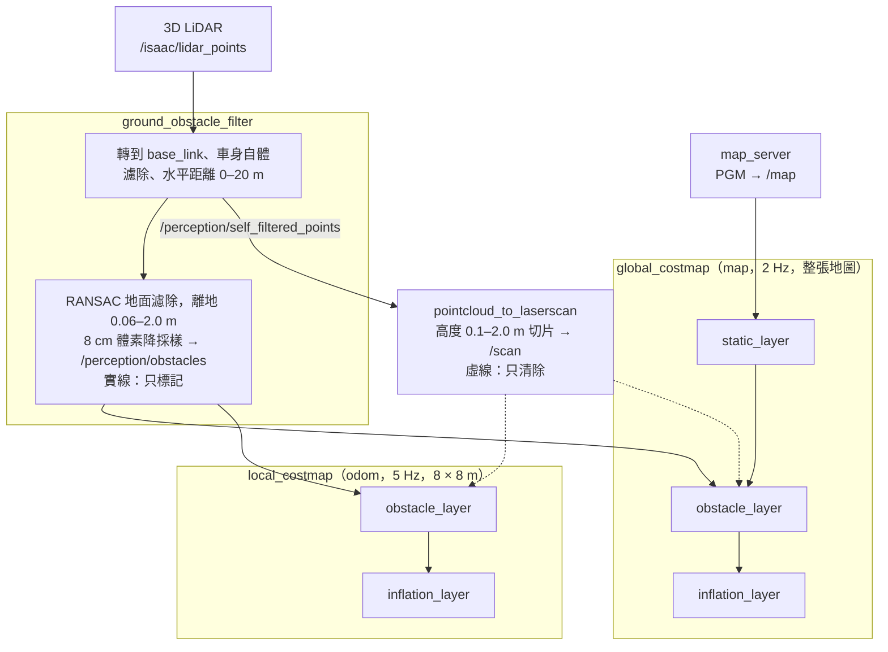
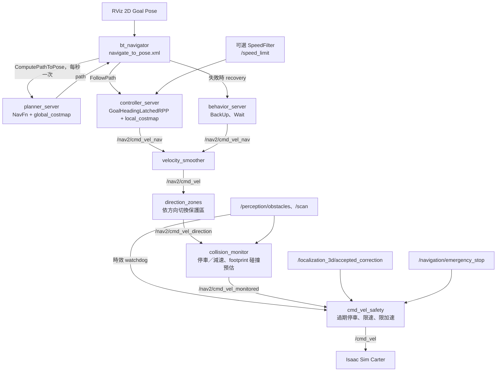
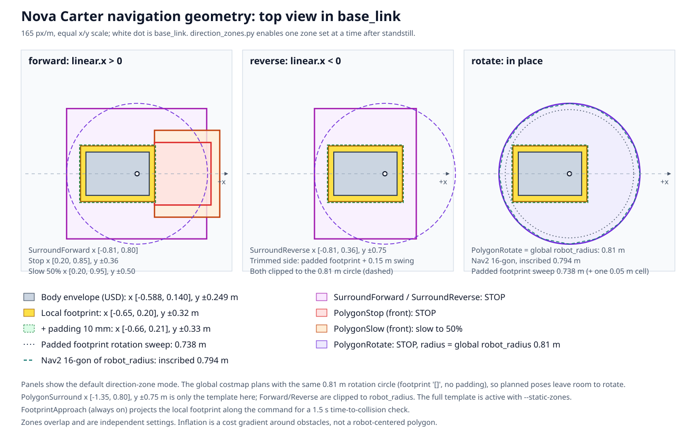

# Nav2 導航架構

本文件說明 `./scripts/run_nav.sh --mode 3d --navigate` 的導航流程：costmap、路徑規劃、控制、recovery 與 `cmd_vel` 安全鏈。定位如何產生 `map -> odom` 和 `odom -> base_link` 見 [`3d_localization.md`](3d_localization.md)。

- 只有 3D 模式有導航；`--mode 2d` 只做 AMCL 定位，不啟動 Nav2。
- 不加 `--navigate` 時，只以 `costmap_observer` 啟動兩張 costmap 供 RViz 觀察，不啟動 planner、controller，也不發布行駛命令。
- Nav2 設定在 `ros2_ws/src/slam_localization_3d/config/`，感測前處理設定在 `ros2_ws/src/slam_nav/config/`；啟動檔是 `slam_localization_3d/launch/global_fusion.launch.py`。

常用指令：

```bash
./scripts/run_nav.sh --mode 3d --navigate                 # 導航，RViz 用 2D Goal Pose 送目標
./scripts/run_nav.sh --mode 3d --navigate --box 2.0,0.0   # 在 Isaac 場景放一個地圖上沒有的箱子
./scripts/run_nav.sh --mode 3d --navigate --filter-editor # RViz 動態標註禁行／限速區
./scripts/run_nav.sh --mode 3d --navigate --static-zones  # 全部保護區同時生效
./scripts/run_nav.sh --mode 3d --navigate --adaptive-surround  # 實驗：速度自適應 Surround
```

以預設 Office 地圖啟動時，`global_pose_adapter` 會自動送出初始位姿；log 出現 `navigator active` 後即可送目標。

## 感測 → costmap



定位與障礙感知共用同一份 `/isaac/lidar_points` 但分開處理：FAST-LIO／PCD 配準負責定位，以下兩路提供導航與防撞的即時障礙資料（`--costmaps`／`--navigate` 會自動啟用 `--obstacle-cloud`）。兩者來自同一顆 LiDAR，不是獨立備援。

**`/perception/obstacles`**（`slam_nav/config/ground_obstacle_filter.yaml`）：

1. 依原始時間戳把點轉到 `base_link`，去除非有限座標。
2. 去除車身矩形內的點（Nova Carter：x −0.65–0.20 m、y ±0.32 m，不限高度），保留水平距離 0–20 m；先發布 `/perception/self_filtered_points`。
3. 以 profile 的 `ground_z` 為中心、±0.25 m 的候選點做 RANSAC 估計近水平地面（至少 50 個內點，距離門檻 0.04 m），且平面須通過距離 `(0, 0, ground_z)` 不超過 0.04 m 的驗證。
4. 保留地面上方 0.06–2.0 m 的點，再以 0.08 m 體素降採樣。

TF 無效時兩份點雲都不發布；找不到可靠地面時只停止發布 `/perception/obstacles`，`/scan` 仍可用。`ground_z` 是地面在 `base_link` 的 z 座標（Nova Carter `0.0`、Carter v1 `-0.24`），只寫在 `config/robots/<type>.yaml` 的 `parameter_overrides.ground_obstacle_filter.ros__parameters`；新車種須在平地量測，不要放大 `ground_distance` 來接受錯誤地面。測試：在 ROS 容器內執行 `python3 -m unittest discover -s tests -p test_ground_obstacle_filter.py -v`。

**`/scan`**：`pointcloud_to_laserscan` 從 self-filtered 點雲取 `base_link` 高度 0.1–2.0 m 的點，每個角度格（約 0.5°，−π–π）留下最近距離，範圍 0–20 m。此分支**不做地面濾除與體素降採樣**，高度以 `base_link` z 裁切，切片內的地面點可能投影進 scan，低於切片的障礙物會漏掉。未啟用障礙點雲時，`/scan` 直接取自 `/isaac/lidar_points`（範圍 0.5–30 m），2D AMCL 模式亦同（設定在 `slam_nav/config/local_odometry.yaml`）。

collision monitor 直接把 `/perception/obstacles` 與 `/scan` 當障礙來源。

## 目標 → 速度命令



`planner_server` 與 `controller_server` 各含一張 costmap；`behavior_server` 訂閱 `local_costmap` 做 BackUp 碰撞檢查。

## 兩張 costmap

每格 0.05 m，代價 0–255：0 空、254 lethal、255 未知，其間為 inflation 擴散。設定在 `observation_costmaps.yaml`。

| | `global_costmap` | `local_costmap` |
| :-- | :-- | :-- |
| 使用者 | `planner_server` | `controller_server`、`behavior_server`（BackUp） |
| 座標系 | `map` | `odom` |
| 範圍 | 整張 PGM | 以車為中心 8 × 8 m 滾動視窗 |
| 更新頻率 | 2 Hz | 5 Hz |
| 圖層 | static、obstacle、inflation | obstacle、inflation |

- **global 管走哪條路**：含 PGM 牆壁，並記得看過的障礙物直到被清除。
- **local 管現在怎麼走**：放在 `odom`，不受 `map -> odom` 校正跳動影響；不載入 PGM，只看感測器，定位誤差時不會被對不準的地圖牆壁擋住。

兩張 costmap 使用相同的 `base_link` footprint（Nova Carter：前 0.20 m、後 0.65 m、左右 0.32 m）與 `footprint_padding: 0.01`，不含 Surround；inflation 半徑 0.9 m，用於產生導航代價，不是安全煞停距離。NavFn 的 2D 搜尋不檢查朝向／轉動掃掠，不能保證路線都符合 Surround。



### 障礙物標記與清除

| 輸入 | 用途 | 設定 |
| :-- | :-- | :-- |
| `/perception/obstacles`（3D，已濾除地面） | 只標記 | `marking: true`、`clearing: false`、`obstacle_max_range: 6.0` |
| `/scan`（2D 切片） | 只清除 | `marking: false`、`clearing: true`、`raytrace_max_range: 7.0` |

- 3D 標記能看到桌面、懸空物，且比高度切片更不易把地面誤判成障礙物。
- 2D 清除是因為 `ObstacleLayer` 是 2D：用 3D 點雲 raytrace，越過矮障礙物、打到後方牆壁的射線壓平後會穿過障礙物格子，把剛標記的障礙物清掉。`/scan` 每角度只取最近點，不會誤清。若要 3D 清除，需改用 `VoxelLayer` 或 STVL（尚未實作）。
- 車子看得到原位置時，障礙物移走後 `/scan` 約 1 秒內清除，BT 每秒重新規劃；在背後、超過 7 m、被擋住或低於 0.1 m 切片時清不掉，會留下殘影，需車子重新看到或 recovery 清除整張 costmap。`/scan` 未打到東西的方向（`use_inf`）不會被清除。

### Costmap filters：禁行區與限速區

資料來自 RViz 人工標註產生的 mask，不是 LiDAR 判斷。未啟用 editor 時不建立 filter 節點。

| Filter | 位置 | 效果 |
| :-- | :-- | :-- |
| Keepout | Global + local | mask 值 100 的格子成為致命代價，planner 必須繞開；filter 後另加 inflation |
| Speed | Local | 依 `base_link` 所在 mask 格發布 `/speed_limit`，限制 RPP 的路徑跟隨線速度 |

使用 `--filter-editor` 啟動後：

1. RViz **Fixed Frame = map**，用 **Publish Point** 依序點出多邊形頂點（不必點回第一個點），黃色輪廓為草稿。
2. 切到 **Interact**，右鍵草稿中央方塊，選 **Apply draft: Keepout** 或 **Apply draft: Speed → 百分比**（5／10／25／50／75／100%）。
3. 已套用區域（紅：禁行，藍：限速）可右鍵中央方塊選 **Edit this zone's vertices** 拖曳頂點，或 **Delete this zone**；**Delete all zones → Confirm delete all** 清除全部。
4. 看不到草稿時，確認 Displays 的 **Costmap zone editor (optional)** 已勾選，且 **Interactive Markers Namespace** 為 `/costmap_filter_editor`。

重疊禁行區取聯集，重疊限速區取較低百分比；Speed mask 的 0 表示不限速，非零為 RPP 目標線速度的百分比。更新即時生效，不需重啟 Nav2。每次成功更新先原子寫入 `maps/costmap_filters/editor.json`（`--filter-state FILE` 可指定其他檔案），下次啟動自動還原；狀態檔含地圖指紋，與目前地圖不符、損壞或無法保存時會報錯。頂點須在地圖內，多邊形不能自交、重複頂點或面積為零；被拒絕的更新不會覆蓋既有區域，狀態見 `/costmap_filters/editor_status`。

Keepout 是軟體限制，collision monitor 不讀 mask。Speed 只限制 RPP 路徑跟隨線速度，**不限制原地旋轉、BackUp、手動或直接送入速度 topic 的命令**，也不是進入邊界前的硬性煞車；限速區需提前擴大。Binary filter 尚未實作。

## 規劃、控制與避障

| 元件 | 設定 | 說明 |
| :-- | :-- | :-- |
| Planner | `NavfnPlanner`，`allow_unknown: false` | 在 global costmap 找最低代價路徑 |
| Controller | `slam_nav::GoalHeadingLatchedRPP`，10 Hz | 目標線速度 0.75 m/s、原地轉向 0.5 rad/s、前視距離 0.8 m；依曲率、接近目標與碰撞預測降速；到位後鎖定原地轉向，不受 1 Hz 重新規劃中斷 |
| Goal checker | `slam_nav::LatchedGoalChecker` | 位置 0.15 m、航向 0.25 rad；到位後鎖定，偏離超過 0.5 m 才解除 |
| Progress checker | `SimpleProgressChecker` | 15 秒內移動不到 0.15 m 視為卡住 |
| `failure_tolerance` | 1.0 秒 | controller 持續失敗超過 1 秒就回報失敗，交給 BT |

**繞障靠 global costmap 重新規劃，不靠 controller。** RPP 只沿路徑走，local costmap 對它只影響碰撞預測時的降速與停車；障礙進入 global costmap 後 BT 每秒重新規劃，新路徑才會繞開。移動中的障礙若尚未進入 global costmap，車子只會減速或停下等待。取樣式 controller（MPPI、DWB）可在 local 視窗內閃避，目前尚未採用。

行駛中前方突然出現障礙時的分工：

| 階段 | 負責 | 資料 | 動作 |
| :-- | :-- | :-- | :-- |
| 緊急反應 | `collision_monitor` | 最新一幀感測資料 | 減速、按比例降速或停車，不需等 costmap |
| 平順減速 | RPP | local costmap | 靠近高代價區降速；預估 1 s 內會撞就停車並回報失敗 |
| 繞過障礙 | `bt_navigator` + `planner_server` | global costmap | 每秒重新規劃 |
| 繞不過或卡住 | `bt_navigator` + `behavior_server` | — | 內層重試仍失敗時進入 recovery，最終中止目標 |

## Behavior tree 與 recovery

`navigate_to_pose.xml` 與 `navigate_through_poses.xml` 結構相同；`bt_navigator` 只在啟動時讀取 XML，修改後需重啟。

1. **內層**：planner 或 controller 失敗時，清除自己的 costmap 並重試一次。
2. **外層**：仍失敗時，輪流執行一個 recovery 再重新規劃與行駛：清除 local + global costmap → Wait 5 s → BackUp 0.3 m（0.1 m/s）→ Wait 10 s。最多 6 次（約 30 秒）後中止目標。
3. 收到新目標（`GoalUpdated`）時立即中止 recovery。

BackUp 以 local costmap footprint 模擬 2 秒內的後退路徑，會撞到就不執行。ClearEntireCostmap 會去掉殘影、定位跳動造成的假障礙，static layer 從 `/map` 還原；真障礙約 1 秒內被 LiDAR 重新標記。

## `cmd_vel` 安全鏈

`controller_server` 與 `behavior_server` 的 `/cmd_vel` 被映射到 `/nav2/cmd_vel_nav`，依序經過：

```
→ velocity_smoother → direction_zones → collision_monitor → cmd_vel_safety → /cmd_vel
```

`direction_zones` 只在 `--navigate` 且未使用 `--static-zones`／`--adaptive-surround` 時啟動，否則 smoother 直接接 monitor。兩道安全關卡只會降速或停車，不會加速；smoother 放在最前，安全停車不會被平滑延遲。

### velocity_smoother

`nav2_velocity_smoother`，設定在 `navigation.yaml`，以 20 Hz 把命令變成斜坡。

| 參數 | 值 |
| :-- | :-- |
| `max_accel` | 線 0.8 m/s²、角 1.5 rad/s² |
| `max_decel` | 線 −1.5 m/s²、角 −2.0 rad/s²（安全停車不受限） |
| `max_velocity` / `min_velocity` | ±0.75 m/s、±0.5 rad/s（與 `cmd_vel_safety` 一致） |
| `velocity_timeout` | 0.5 s |
| `feedback` | `OPEN_LOOP` |

不用 `CLOSED_LOOP`：原地旋轉時 Carter 輪子在約 0.1 rad/s 克服不了摩擦，量測速度一直是 0，車子會卡住不轉。`OPEN_LOOP` 看不到下游停車，因此由 `cmd_vel_safety` 記錄實際輸出，解除後從零逐步加速。smoother 計時器使用 wall time，模擬較慢時以模擬時間換算的加速度略高。

### collision_monitor

`nav2_collision_monitor`（`collision_monitor.yaml`）不看 costmap，每次收到速度命令就用最新感測資料檢查，沒有 costmap 的更新延遲與殘影；它是最後一道感測防撞，應付 costmap 還沒更新的突發近距離障礙。

| 區域 | 範圍（`base_link`） | 動作 |
| :-- | :-- | :-- |
| `PolygonStop` | x 0.20–0.85 m，y ±0.36 m | 超過 3 個點就停車 |
| `PolygonSurround` | x −1.35–0.80 m，y ±0.75 m | 超過 3 個點就停車，涵蓋側面、後方與近車頭 |
| `PolygonSlow` | x 0.20–0.95 m，y ±0.50 m | 超過 3 個點降為 50% |
| `FootprintApproach` | local costmap footprint | 沿目前命令模擬 1.5 秒，依碰撞時間按比例降速，後退與原地旋轉也檢查 |

以上為 `--static-zones` 時同時生效的原始區域；預設依方向只啟用一組。固定區域不會隨 footprint 自動更新，換車或提高速度時需重新調整並驗證，發布零速也不代表車體瞬間停止。感測來源時間戳落後超過 1 秒時 monitor 會忽略該來源，停車後持續發布零速 2 秒（`stop_pub_timeout`）。所有 Surround 變體都發布在 `/collision_monitor/polygon_surround`，RViz 顯示目前啟用的那組（Stop 紅、Surround 粉紅、Slow 橘）。

自體濾除與保護區須隨機器人幾何一起調整；這只解決軟體距離濾除的盲區，不涵蓋 LiDAR 物理遮蔽、最短量測距離或點數不足。

#### 方向切換保護區（預設）

Humble 的 `stop` 區域不分命令方向，車頭前有障礙時連 BackUp 與原地旋轉都會被擋下，recovery 可能永遠動不了。`direction_zones.py` 以原生 `<polygon>.enabled` 原子參數服務，在三組區域間切換（類似 AGV 安全雷射的 field switching）：

| 方向組 | 判斷 | 啟用的區域 | 轉發限制 |
| :-- | :-- | :-- | :-- |
| forward | `linear.x` > 0.01 m/s | `PolygonStop`、`PolygonSlow`、`PolygonSurroundForward`（後緣縮到 padded footprint 後方 0.15 m） | 只轉發 `linear.x` ≥ 0 |
| reverse | `linear.x` < −0.01 m/s | `PolygonSurroundReverse`（前緣縮到 padded footprint 前方 0.15 m） | 只轉發 `linear.x` ≤ 0 |
| rotate | 線速度在 ±0.01 內且 \|`angular.z`\| > 0.02 rad/s | 完整 `PolygonSurround` | 線速度歸零，只轉發角速度 |

- `FootprintApproach` 一直啟用，也會檢查轉彎時車角的掃掠。
- Forward／Reverse 由 launch 依 profile 的 `PolygonSurround` 與 local footprint 自動產生；`swing_margin: 0.15` m（`direction_zones.yaml`）是被縮側車角的擺動裕度。Nova Carter：forward x −0.81–0.80 m，reverse x −1.35–0.36 m。
- 要求不同方向時先輸出零速，等至少 0.2 秒，且收到 barrier 之後的 `/odometry/local` 證實 twist 與位姿差分都在 0.03 m/s、0.05 rad/s 內，才原子切換；monitor 回覆成功前一律輸出零速。命令或里程計過期（0.3 秒）時不切換；切換被拒絕、逾時或 selector 結束時命令不再流到 monitor，`cmd_vel_safety` 於 0.5 秒後停車，需重啟。RPP 在原地轉向與前進之間轉換時會多停約 0.2–0.4 秒。
- 典型 deadlock：前方障礙進入 `PolygonStop` 而停車後，BackUp 切到 reverse 組後退；障礙若在完整 Surround 內，旋轉仍會被擋下。

`--static-zones`（或 `direction_zones:=false`）恢復全部區域同時生效；此時及 `--adaptive-surround` 下停車區不分方向，BackUp 會被前方障礙擋下，只能等障礙離開或 recovery 用完後中止。

#### 速度自適應 Surround（實驗）

`--adaptive-surround`（`adaptive_surround.yaml`）取代方向切換保護區，在兩個預設 Surround 間切換：

| 模式 | Surround（`base_link`） | 速度上限 |
| :-- | :-- | :-- |
| 一般 | x −1.35–0.80 m、y ±0.75 m | 0.75 m/s、0.5 rad/s |
| Crawl | x −0.90–0.45 m、y ±0.55 m | 0.10 m/s、0.20 rad/s |

啟用時 RPP 目標線速度改為 0.10 m/s、轉向 0.15 rad/s，smoother 角速度上限改為 ±0.20 rad/s。只有命令在 Crawl 上限內，且 `/odometry/local` 的 twist 與位姿差分在 0.12 m/s、0.22 rad/s 內持續 0.5 秒，才允許縮小；要求較快速度時先停車再擴大，monitor 確認後才轉發。切換期間一律輸出零速；`cmd_vel_safety` 要求帶時戳的限速心跳（超過 0.2 秒沒有就停車）。缺少命令／里程計、無效數值、時鐘倒退或切換失敗都不放行，selector 結束後需重啟。Crawl 仍不分行進方向、也會阻擋原地轉向，不是貼牆旋轉；不能因此提高限速或縮小區域，也不能取代保護區朝向／轉動掃掠的規劃，窄通道仍可能因 Crawl 區侵入側牆而停住。

### cmd_vel_safety

| 條件 | 行為 |
| :-- | :-- |
| 命令含 NaN/Inf，或有非平面分量 | 零速 |
| 4 秒內沒有 `/localization_3d/accepted_correction`（PCD 校正過期） | 零速 |
| `/scan` 與 `/perception/obstacles` 都沒有 1 秒內的新資料 | 零速；任一來源恢復後才允許新命令 |
| `/navigation/emergency_stop` 為 `true` | 鎖定停車，需重啟 |
| 0.5 秒未收到新命令 | 零速；下一個命令從零起步 |
| adaptive 模式缺少有效限速心跳或正在等待切換確認 | 零速；否則套用目前區域上限 |
| 其他 | 限速 `max_linear_speed` 0.75 m/s、`max_angular_speed` 0.5 rad/s，再限制加速；減速與停車立即轉發 |

- 加速限制：`max_linear_accel: 0.8` m/s²、`max_angular_accel: 1.5` rad/s²（與 smoother 一致）；以 ROS 時間計算，每次最多計入 0.1 秒。monitor 零速、感測或校正過期、無效命令、emergency stop 都立即歸零並重設起步狀態；恢復後從零逐步加速，方向反轉先輸出零速。
- watchdog 每 0.1 秒檢查一次，即使 monitor 沒再送命令也會主動發布零速，不重播舊命令；`sensor_timeout` 須與 monitor 的 `source_timeout` 一致。新鮮度依訊息時間戳與 ROS 時間計算，模擬暫停（`/clock` 停止）不會按現實時間過期；時間倒退時清空狀態，需重新收到資料。這只檢查資料時效，不能判斷盲區或資料完整性。
- 校正過期時 `global_tf_gate` 也會停止發布 `map -> odom`，Nav2 因此查不到 TF 而無法繼續規劃與控制。
- Isaac Sim 在 0.5 秒收不到命令時也會自行停車。

重現煞停與導航驗證（可用 `ISAAC_PYTHON` 指定 Isaac Sim launcher）：

```bash
bash tests/run_navigation_environment.sh --braking
bash tests/run_navigation_environment.sh --repeats 1 --cases baseline
```

`tests/run_navigation_environment.sh` 需先停止一般模擬，使用獨立的 Compose project 與 ROS domain 189（`VALIDATION_ROS_DOMAIN_ID` 可覆寫），不開 RViz 與 filter 區域。預設每案重複 2 次，涵蓋 baseline 導航、兩種橫穿速度、空地與 1.8 m 通道內的移動障礙，以及 1.8／1.6／1.4／0.6 m 通道；`--cases ... --repeats N` 可選子集，結果存於 `ros2_ws/log/navigation_environment/<時間>/`。通過條件是可通行情境到達目標、過窄通道安全停住，且保守車體包絡淨空至少 2 cm；不安全淨空會鎖定 emergency stop 並中止整組測試。淨空以 2D USD 車體包絡估計，不是 PhysX 接觸感測。`--adaptive-surround` 另有針對 Crawl 區域的通道與煞停測試案例。

## 目前限制

- `collision_monitor` 區域只在 Office／Nova Carter 平地模擬驗證過；點數門檻、稀疏／低矮障礙及更差的感測延遲未驗證，不是認證安全區。
- RPP 不會在 local costmap 內主動繞開移動中的障礙物，也沒有移動物體軌跡預測；動態橫穿仍曾出現車體包絡與障礙重疊。
- 規劃與執行未實作完整的保護區朝向／轉動掃掠檢查；較寬通道仍可能因偏移或轉向讓牆面進入 `PolygonSurround` 而卡住。
- Speed 不涵蓋 recovery、原地旋轉或直接速度命令；Binary 開關區未實作。
- 斜坡、複雜人流與完整動態清除未驗證。
- 多車以 namespace 與獨立 `/NAME/tf` 支援，見 [multi_robot.md](multi_robot.md)，車輛之間無協調。
- 真實車輛導航安全尚未驗證；使用時先在 RViz 確認 costmap 與規劃路徑。
