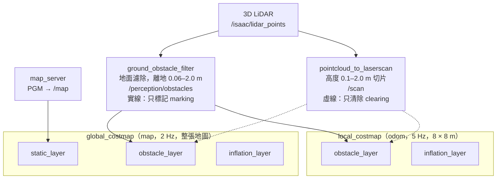
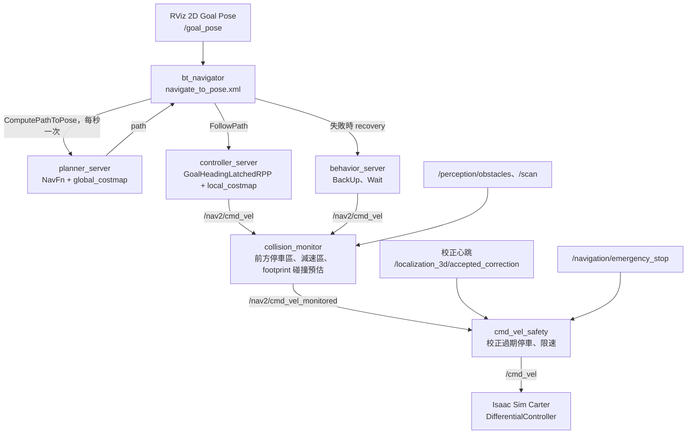
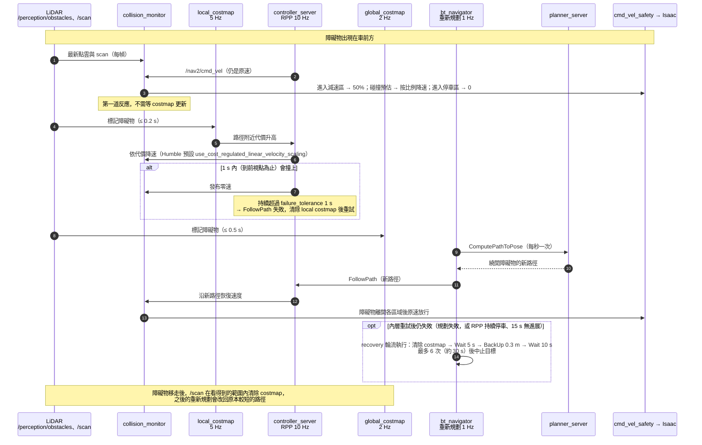
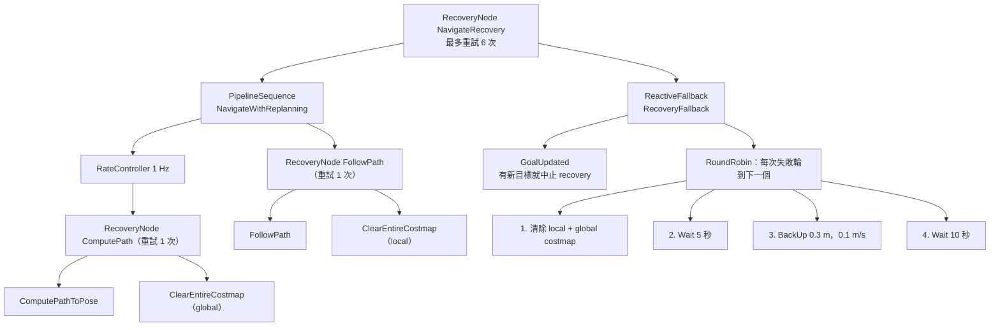
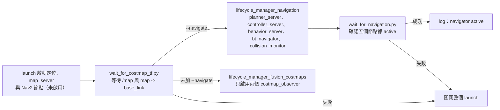

# Nav2 導航架構

本文件說明 `./run_nav.sh --mode 3d --navigate` 的導航流程：costmap、路徑規劃、控制、recovery 與 `cmd_vel` 安全鏈。定位如何產生 `map -> odom` 和 `odom -> base_link` 見 [`3d_localization.md`](3d_localization.md)。

- 只有 3D 模式有導航；`run_nav.sh --mode 2d` 只做 AMCL 定位，不啟動 Nav2。
- 不加 `--navigate` 時，只以 `costmap_observer` 啟動兩張 costmap 供 RViz 觀察，不啟動 planner、controller，也不發布行駛命令。
- 設定檔都在 `ros2_ws/src/isaac_localization_3d/config/`，啟動檔是 `launch/global_fusion.launch.py`。

## 整體資料流

分成兩部分：感測資料如何進入 costmap，以及目標如何變成車子的速度命令。

### 感測 → costmap



兩張 costmap 都用 3D 定位發布的 TF 查車體位置：`map -> odom` 由 `global_tf_gate` 發布，`odom -> base_link` 由 `local_ekf` 發布（見 [`3d_localization.md`](3d_localization.md)）。

### 目標 → 速度命令



`planner_server` 和 `controller_server` 各自內含一張 costmap；`behavior_server` 則訂閱 `local_costmap` 做 BackUp 碰撞檢查。recovery 時 BT 也會呼叫兩張 costmap 的清除服務，見下方「Behavior tree 與 recovery」。

## 兩張 costmap

costmap 是 2D 格子地圖，每格 0.05 m，存 0–255 的代價：0 是空的、254 是障礙物（lethal）、255 是未知，中間是 inflation 擴散的代價。各圖層分別寫入後合併。設定在 `observation_costmaps.yaml`。

| | `global_costmap` | `local_costmap` |
| :-- | :-- | :-- |
| 使用者 | `planner_server`：規劃整條路徑 | `controller_server`：沿路徑決定速度；`behavior_server`：BackUp 碰撞檢查 |
| 座標系 | `map` | `odom` |
| 範圍 | 整張 PGM | 以車為中心 8 × 8 m 滾動視窗 |
| 更新頻率 | 2 Hz | 5 Hz |
| 圖層 | `static_layer`、`obstacle_layer`、`inflation_layer` | `obstacle_layer`、`inflation_layer` |

分成兩張是因為用途不同：

- **global 管「走哪條路」**，需要完整：包含 PGM 牆壁，並記得看過的障礙物，直到被清除。
- **local 管「現在怎麼走」**，需要快而穩：它放在 `odom`，不會因 PCD 校正讓 `map -> odom` 跳動而跟著跳，controller 不會因此急轉或急停；它不載入 PGM，只看感測器，定位誤差時不會被對不準的地圖牆壁擋住。

兩張共用同一個 `base_link` 矩形 footprint（前 0.65 m、後 0.20 m、左右各 0.32 m）和 0.9 m inflation 半徑。這兩個值都是估計值，還不是驗證過的安全距離。

### 障礙物標記與清除

兩張 costmap 的 `obstacle_layer` 都有兩個輸入，分工不同：

| 輸入 | 用途 | 設定 |
| :-- | :-- | :-- |
| `/perception/obstacles`（3D，已濾除地面） | 只標記 | `marking: true`、`clearing: false`、`obstacle_max_range: 6.0` |
| `/scan`（2D 切片） | 只清除 | `marking: false`、`clearing: true`、`raytrace_max_range: 7.0` |

- **用 3D 標記**：可以看到桌面、懸空物等 2D 切片可能掃不到的障礙物，且地面濾除比單純高度切片更不容易把地面誤判成障礙物。
- **用 2D 清除**：清除靠 raytrace，把感測器到打到點之間的格子設成空的。`ObstacleLayer` 是 2D 的，若用 3D 點雲清除，越過矮障礙物、打到後方牆壁的射線壓平後會穿過障礙物所在的格子，把剛標記的障礙物清掉。`/scan` 每個角度只取最近的點，射線停在第一個障礙物上，不會誤清。3D 點雲的 raytrace 計算量也遠大於 720 條 scan 射線。
- 要用 3D 清除，需改用 3D 體素圖層，例如 `VoxelLayer` 或 STVL（規劃項目）。

costmap 標記過的格子不會自己消失，只能靠清除：

- 車子看得到原位置時，障礙物移走後 `/scan` 會在 1 秒內清掉它；BT 每秒重新規劃，路徑約 1–2 秒內改回。
- 在車子背後、超過 7 m、被擋住，或低於 `/scan` 的 0.1 m 下限時，清除不到，會留下殘影。需等車子重新看到，或 recovery 清除整張 costmap。
- `/scan` 設了 `use_inf: true`，但 costmap 未開 `inf_is_valid`，沒有打到東西的方向不會被清除。

## 規劃、控制與避障

| 元件 | 設定 | 說明 |
| :-- | :-- | :-- |
| Planner | `nav2_navfn_planner/NavfnPlanner`（Dijkstra），`allow_unknown: false` | 在 global costmap 找最低代價路徑 |
| Controller | `isaac_nav::GoalHeadingLatchedRPP`，10 Hz | Regulated Pure Pursuit：目標速度 0.5 m/s、前視距離 0.8 m；依曲率、接近目標與碰撞預測降速；到達位置後鎖定原地轉向，不會因 1 Hz 重新規劃而中斷 |
| Goal checker | `isaac_nav::LatchedGoalChecker` | 位置誤差 0.15 m、航向 0.25 rad；到位後鎖定，偏離超過 0.5 m 才解除 |
| Progress checker | `SimpleProgressChecker` | 15 秒內移動不到 0.15 m 視為卡住 |
| `failure_tolerance` | 1.0 秒 | controller 持續失敗超過 1 秒就回報失敗，交給 BT 處理 |

**繞過障礙物靠 global costmap 重新規劃，不是靠 controller。** RPP 只會沿著路徑走；local costmap 對它的作用只有碰撞預測時停車與降速。障礙物進入 global costmap 後，BT 每秒呼叫 planner，新路徑就會繞開。

會在 local costmap 內自行繞開的是 MPPI、DWB 這類取樣式 controller，但它們只看未來幾秒、8 m 視窗內的範圍。整條路被擋時仍需 global 重新規劃，所以兩者是互補的：global 決定路線；local controller 應付移動中的障礙與小幅偏移。目前尚未換用 MPPI。

測試時可用 `--box` 在 Isaac 場景放一個靜態箱子。箱子不在 PGM/PCD 地圖裡，只靠 LiDAR 進入 costmap：

```bash
./run_nav.sh --mode 3d --navigate --box 2.0,0.0
```

從 RViz 送 (3.5, 0) 的目標，路徑會繞過箱子。

### 遇到動態障礙物時的處理順序

下圖是行駛中前方突然出現障礙物（例如行人走進路線）時，各元件的處理順序。**減速與停車**由 `collision_monitor` 和 RPP 分工處理，**繞過障礙物**只靠 global costmap 重新規劃。圖中的時間是依更新頻率推算的上限，不是實測值。



| 階段 | 誰負責 | 依據的資料 | 動作 |
| :-- | :-- | :-- | :-- |
| 緊急反應 | `collision_monitor` | 最新一幀感測資料 | 減速、按比例降速或停車；不會換路線 |
| 平順減速 | RPP | local costmap | 靠近高代價區時降速；預估 1 s 內會撞就停車並回報失敗 |
| 繞過障礙物 | `bt_navigator` + `planner_server` | global costmap | 每秒重新規劃，產生繞開的路徑 |
| 繞不過去或卡住 | `bt_navigator` + `behavior_server` | — | 規劃或行駛任一方在內層重試後仍失敗時，清除 costmap、等待、後退，仍失敗就中止 |

RPP 不會在 local costmap 裡自己找路繞開，只會沿著 planner 給的路徑減速或停車。因此移動中的障礙物如果還沒進入 global costmap，車子只會減速或停下等待，不會閃避。

## Behavior tree 與 recovery

`navigate_to_pose.xml` 和 `navigate_through_poses.xml` 結構相同。`bt_navigator` 只在啟動時讀取 XML，修改後要重啟 stack。



1. **內層**：planner 或 controller 失敗時，先清除自己的 costmap，再重試一次。
2. **外層**：仍失敗時，依序輪流執行一個 recovery 動作，再從頭規劃與行駛。最多 6 次，約 30 秒，讓車子有時間等其他車輛或行人通過。之後才中止目標。
3. 收到新目標（`GoalUpdated`）時，立即中止 recovery。

BackUp 和 Wait 是 `nav2_behaviors` 內建的 plugin，由 `behavior_server` 執行（`navigation.yaml` 的 `behavior_plugins: ["backup", "wait"]`）。BackUp 以 local costmap footprint 模擬 2 秒內的後退路徑，會撞到就不執行。

ClearEntireCostmap 會清掉 global costmap 所有看過的障礙物，但 static layer 會從 `/map` 還原。清除的目的是去掉殘影、定位跳動或誤判造成的假障礙物；真的障礙物會在 1 秒內被 LiDAR 重新標記。

## `cmd_vel` 安全鏈

`controller_server` 和 `behavior_server` 都不直接控制車子，它們的 `/cmd_vel` 被重新映射到 `/nav2/cmd_vel`，依序經過兩道關卡才到 Isaac Sim 訂閱的 `/cmd_vel`：

```
controller / behavior → /nav2/cmd_vel → collision_monitor → /nav2/cmd_vel_monitored → cmd_vel_safety → /cmd_vel
```

兩道關卡都只會降速或停車，不會加速，所以最終速度取最嚴格的限制。

### collision_monitor

Nav2 Humble 內建的 `nav2_collision_monitor`，設定在 `collision_monitor.yaml`。它不看 costmap，每收到一次速度命令，就用最新的感測資料檢查一次，不會有 costmap 的更新延遲和殘影。RPP 負責依 costmap 平順降速與停車，`collision_monitor` 則是最後一道防撞保護，應付 costmap 還沒更新的突發近距離障礙物。

| 區域 | 範圍（`base_link`） | 動作 |
| :-- | :-- | :-- |
| `PolygonStop` | 車頭前 0.25 m（x 0.65–0.90 m，y ±0.36 m） | 超過 3 個點就停車（線速度、角速度都歸零） |
| `PolygonSlow` | 車頭前 0.75 m（x 0.65–1.40 m，y ±0.50 m） | 超過 3 個點就降為 50% |
| `FootprintApproach` | local costmap 的 footprint（`/local_costmap/published_footprint`） | 沿目前命令模擬 1.5 秒，依距離碰撞的時間按比例降速；會考慮行進方向，後退和原地旋轉也會檢查 |

- 感測來源：`/perception/obstacles`（地面濾除後的 3D 點）和 `/scan`（2D 切片）。找不到地面時，`ground_obstacle_filter` 會停止發布，這時仍有 `/scan` 可用。
- 兩個來源都會丟掉距 `base_link` 0.5 m 內的點，所以車身兩側和後半部是盲區，停車區和減速區只設在車頭前方。
- 停車區不分方向：障礙物在停車區內時，BackUp 後退也會被擋下，只能等障礙物離開，或在 recovery 用完後中止目標。
- 來源超過 1 秒沒更新時，Humble 版會忽略該來源並放行命令（fail-open），`cmd_vel_safety` 也不檢查這一點。
- 停車後會繼續發布零速 2 秒（`stop_pub_timeout`），之後停止發布；Isaac Sim 在 0.5 秒收不到命令時也會自行停車。
- RViz 會顯示停車區（紅）和減速區（橘）。

### cmd_vel_safety

| 條件 | 行為 |
| :-- | :-- |
| 命令含 NaN/Inf，或有非平面分量（`linear.y/z`、`angular.x/y`） | 發布零速 |
| 4 秒內沒有 `/localization_3d/accepted_correction`（PCD 校正過期） | 發布零速 |
| 收到 `/navigation/emergency_stop` 為 `true` | 鎖定停車，需重啟才能恢復 |
| 其他 | 限制在 0.75 m/s、0.7 rad/s 後轉發 |

安全節點不會放寬校正時效；`global_tf_gate` 也會在校正過期時停止發布 `map -> odom`，Nav2 因此查不到 TF，無法繼續規劃與控制。

## 啟動順序



以預設 Office 地圖啟動時，`global_pose_adapter` 會自動發送 Carter 出生點附近的初始位姿，不需要在 RViz 點選。log 出現 `navigator active` 後，即可用 RViz「2D Goal Pose」送目標。

## 目前限制

- 尚未加入 `velocity_smoother`；`collision_monitor` 的區域大小與點數門檻是估計值，停車距離尚未驗證。
- RPP 不會在 local costmap 內主動繞開移動中的障礙物。
- footprint 與 inflation 為估計值；斜坡、動態障礙物清除與狹窄路線的碰撞安全仍未驗證。
- topic 與 TF frame 都是固定名稱，還不支援多台機器人（namespace）。
- 真實車輛導航安全尚未驗證。只在淨空的 Office 模擬中測試，並先在 RViz 確認 costmap 與規劃路徑。
