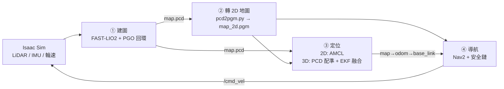

# 專案概觀

本專案用 Isaac Sim 模擬 Nova Carter（及 Carter v1），以 FAST-LIO2 建 3D 地圖，再以 3D 點雲配準做全域定位，並用 Nav2 在對應的 2D 地圖上導航。Isaac Sim 在主機執行，ROS 2 Humble 全部在 Docker 內執行（見 [isaac_bridge.md](isaac_bridge.md)）。

## 整體流程

| 步驟 | 指令 | 說明文件 |
| :-- | :-- | :-- |
| ① 建圖與存圖 | `./scripts/run_slam.sh`、`./scripts/save_map.sh` | [mapping_flow.md](mapping_flow.md) |
| ② 轉 2D 地圖 | `./scripts/pcd2pgm.py` | [mapping_flow.md](mapping_flow.md) |
| ③ 定位 | `./scripts/run_nav.sh --mode 2d` 或 `--mode 3d` | [3d_localization.md](3d_localization.md) |
| ④ 導航 | `./scripts/run_nav.sh --mode 3d --navigate` | [nav.md](nav.md) |
| 多車、換車種 | `./scripts/run_multi_nav.sh` | [multi_robot.md](multi_robot.md)、[covariance_calibration.md](covariance_calibration.md) |

## 設計理念

- **3D 定位、2D 導航**：PCD 配準比 2D 掃描比對更能約束位置，但 Nav2 的 costmap 以 2D 為主，所以用同一份 PCD 投影出 PGM。PGM 與 PCD 必須共用相同的 `map` 原點、方向與尺度。
- **定位與障礙感知分開**：FAST-LIO／PCD 配準只負責定位；導航與防撞另用同一顆 LiDAR 的即時點雲（`/perception/obstacles`、`/scan`），兩者不是獨立備援。
- **Local／Global EKF 分層**：Local EKF（輪速 + IMU）提供平滑連續的 `odom -> base_link`；PCD 配準在 Global EKF 內提供低頻、有雜訊但不漂移的全域校正，再由 `global_tf_gate` 產生 `map -> odom`。Local costmap 放在 `odom`，所以校正造成的 `map -> odom` 跳動不會讓 controller 急轉。
- **`map -> odom` 只能有一個發布者**：2D 模式由 AMCL 發布，3D 融合模式由 `global_tf_gate` 發布，兩種模式不能同時執行。校正過期（4 秒）時閘控停止發布並讓車停下，而不是繼續使用過期的位姿。
- **多層速度安全鏈**：Nav2 只提出速度命令，最後經 smoother、方向保護區、collision monitor 與 `cmd_vel_safety` 才到車子；這些關卡只會降速或停車，感測、校正或命令過期一律停車。
- **車種相關值集中在 profile**：輪徑、輪距、covariance、footprint、保護區與速度上限都在 `config/robots/<type>.yaml`，共用設定檔不含這些值。
- **一車一 container**：多車與真車部署同構，所有 topic 與 TF 都放在 `/NAME` namespace 下。

## 套件與目錄

| 路徑 | 內容 |
| :-- | :-- |
| `scripts/` | 啟動腳本與工具（`run_*.sh`、`standalone.py`、`save_map.sh`、`pcd2pgm.py`、`usd_bbox.py`） |
| `ros2_ws/src/` | ROS 套件，分工見 [isaac_bridge.md](isaac_bridge.md#套件分工) |
| `docker/`、`docker-compose.yml` | ROS 執行環境 |
| `maps/` | 地圖與標註資料（`map.pcd`、`map_2d.pgm/yaml`、`costmap_filters/`） |
| `tests/` | 單元測試與 Isaac Sim 驗證腳本 |
| `patches/` | 建置時套用於上游 PGO 的 patch |

## 開發與驗證

- 修改 `ros2_ws/src` 後執行 `docker compose run --rm ros build`（可加 `--packages-select <pkg>`）。
- 單元測試位於 `tests/test_*.py`；容器內以 `python3 -m unittest discover -s tests -p "test_*.py" -v` 執行（專案已掛載於 `/workspace`），僅需 Python 的測試可直接在主機執行。
- 涉及模擬的驗證：`tests/run_navigation_environment.sh`（煞停與導航，見 [nav.md](nav.md#cmd_vel_safety)）、`tests/run_multi_robot_navigation.sh`（多車）、`tests/run_fleet_panel.sh`（RViz 選車面板）。
- 修改車體尺寸、速度或保護區後，需重新驗證碰撞停止行為；修改 BT XML 需重啟 Nav2。

## 疑難排解

| 現象 | 檢查 |
| :-- | :-- |
| 啟動後 GUI 打不開 | 確認 `DISPLAY`；使用 Xauthority 時設定 `XAUTHORITY` |
| 找不到 Isaac Sim | 修改 `scripts/standalone.py` 等 shebang，或設定 `ISAAC_PYTHON`（見根 README） |
| 腳本被拒絕啟動、埠或 container 衝突 | 上次執行的 container 或 Isaac 殘留；確認舊程序已結束、`docker ps` 沒有 `isaacsim-fastlio2-*` 後重試 |
| 無法規劃或 Nav2 沒有 `navigator active` | 確認定位 TF（`map -> base_link`）存在；3D 模式需先有被接受的 PCD 配準，非 Office 起點要加 `--manual-initial-pose` 並在 RViz 點 **2D Pose Estimate** |
| 車子突然停住 | 可能是 PCD 校正逾時（4 秒）、感測資料過期（1 秒）、命令中斷（0.5 秒）或 collision monitor 觸發；看 `cmd_vel_safety` 與 `collision_monitor` 的 log，見 [nav.md](nav.md#cmd_vel_safety) |
| Nav2 報 `Transform data too old`、local costmap 旋轉 | 見 [isaac_bridge.md](isaac_bridge.md#docker-運作方式) 的 tf2 修補；local costmap 在 `odom` 下於 RViz 顯示旋轉是預期行為 |
| 修改 `ros2_ws/src` 後行為沒變 | 沒有重新 `docker compose run --rm ros build`；或舊套件殘留在 `ros2_ws/build`、`install` |
| 兩種定位模式同時執行後 TF 抖動 | 2D 與 3D 模式都會發布 `map -> odom`，只能啟動一個 |
